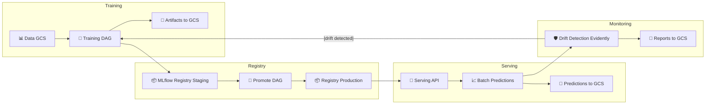
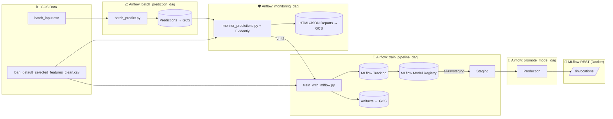
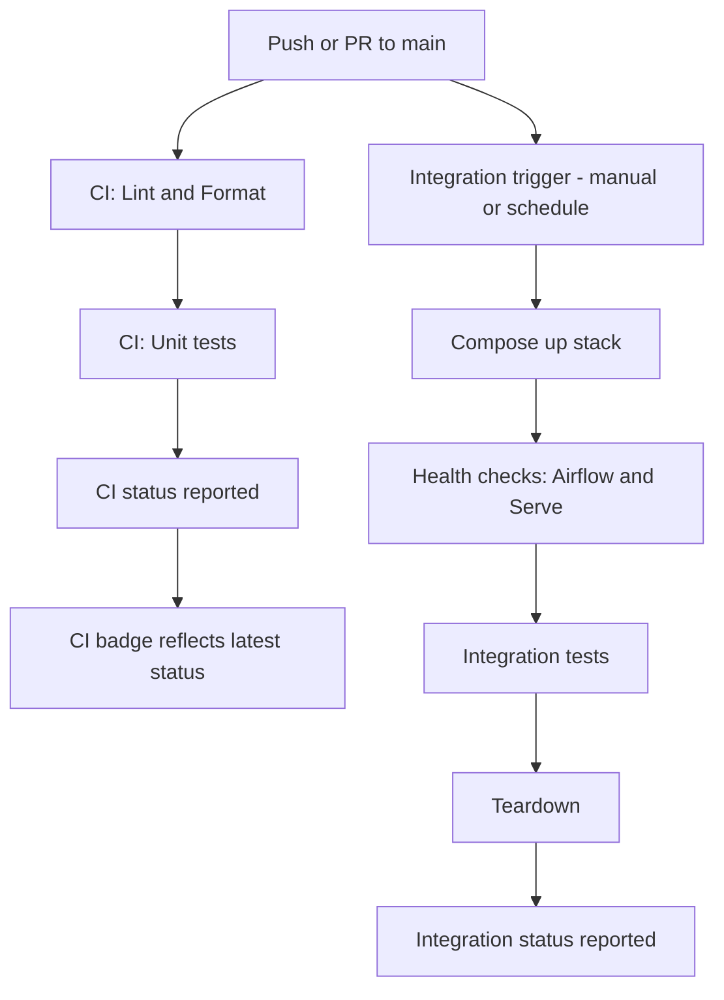

[](https://github.com/JDede1/loan_default_prediction/actions/workflows/ci.yml)

<!--
[](https://github.com/JDede1/loan_default_prediction/actions/workflows/ci-integration.yml)
-->

# 🏦 Loan Default Prediction – End-to-End MLOps Project

This project implements an **end-to-end MLOps pipeline** for predicting loan defaults using the [LendingClub dataset](https://www.kaggle.com/wordsforthewise/lending-club). The goal is to help financial institutions and lenders **assess borrower risk** and make more informed lending decisions.


---
## ✅Capstone Evaluation Criteria Mapping

This project meets the **DataTalksClub MLOps Zoomcamp** capstone requirements:

* **Problem description** → Clear business use case: loan default prediction.
* **Cloud (GCP + Terraform)** → Infrastructure provisioned with IaC (`infra/terraform`).
* **Experiment tracking & registry** → MLflow (tracking, artifacts, registry, model aliases).
* **Workflow orchestration** → Apache Airflow DAGs (training, batch prediction, monitoring, promotion).
* **Model deployment** → Dockerized MLflow REST API serving models from registry aliases.
* **Model monitoring** → Evidently AI for drift detection, automated reports.
* **Reproducibility** → Makefile, pinned dependencies, `.env`, and Terraform ensure reproducibility.
* **Best practices** → Unit + integration tests, linting, formatting, type checking, Makefile, CI/CD (GitHub Actions).
---


---
## 📌 Project Overview

The pipeline covers the full machine learning lifecycle:

* **Data ingestion & preprocessing** – clean, transform, validate input loan data.
* **Model training & experiment tracking** – XGBoost, Logistic Regression, Random Forest, tracked with **MLflow**.
* **Model registry & versioning** – MLflow Staging/Production with alias promotion DAG.
* **Model serving** – Dockerized MLflow REST API for real-time inference.
* **Batch inference pipeline** – automated via **Airflow DAGs**.
* **Monitoring & drift detection** – Evidently AI reports for data/target drift.
* **Infrastructure-as-Code (IaC)** – GCP resources provisioned with **Terraform**.
* **CI/CD** – Linting, testing, and integration checks with **GitHub Actions**.

> ℹ️ **Note**: Airflow DAGs are the main orchestration method. Manual commands are included for debugging/quick checks.
---


---
## 📊 Dataset

* **Source:** LendingClub Loan Dataset (public via Kaggle).
* **Target:** `loan_status` (binary: default vs. non-default).
* **Storage (single, consistent bucket):** `gs://loan-default-artifacts-loan-default-mlops/`

**Canonical paths**

* **Training data:**
  `gs://loan-default-artifacts-loan-default-mlops/data/loan_default_selected_features_clean.csv`
* **Batch input (example):**
  `gs://loan-default-artifacts-loan-default-mlops/data/batch_input.csv`
* **Local samples (for quick runs/tests):**
  `data/batch_input.csv`, `data/sample_input.json`

**Schema expectations**

* Features must match the columns used during training (see `data/sample_input.json` for request shape and `data/batch_input.csv` for column order).
* If you add/remove features, **retrain** and **re-register** the model so the serving signature and batch pipeline stay consistent.

**Repro tips**

* Keep the cleaned training CSV immutable; write derived artifacts (predictions, reports) to separate prefixes:

  * Predictions → `gs://loan-default-artifacts-loan-default-mlops/predictions/...`
  * Monitoring reports → `gs://loan-default-artifacts-loan-default-mlops/reports/...`

---


---
## 🏗️ Architecture & Tools

### High-Level Workflow


### Detailed Architecture


**Key design choice — MLflow Serving (no custom API):**

* Serve **by alias** (`staging` / `production`) from the **Model Registry**.
* Zero app code to maintain; standard `/invocations` contract.
* Works the same locally, in CI, or on Kubernetes.

### Tooling (consistent & pinned)

* **ML lifecycle**

  * **MLflow 3.1.4** — tracking, registry, artifacts, serving
  * **scikit-learn / XGBoost** — modeling
  * *(Optional)* **Optuna** — add only if you use tuning (pin in requirements)

* **Orchestration**

  * **Apache Airflow 2.8.1 (Py3.10)** — four DAGs:

    * `train_pipeline_dag`
    * `promote_model_dag`
    * `batch_prediction_dag`
    * `monitoring_dag`

* **Monitoring**

  * **Evidently** — drift/quality reports (HTML/JSON) stored in GCS

* **Infra / Packaging**

  * **Docker** — containers for Airflow, MLflow, Serving, Terraform
  * **Terraform** — GCP resources (bucket, SA, IAM)
  * **GCS** — artifact store, predictions, reports

* **DevEx / Quality**

  * **Makefile** — one-liners (start/stop/lint/test/terraform)
  * **pytest, flake8, black, isort, mypy**
  * **GitHub Actions** — CI (lint + unit; optional integration)

### Service boundaries

| Component       | Responsibility                                     | Notes                       |
| --------------- | -------------------------------------------------- | --------------------------- |
| Airflow         | Schedule & run data/train/batch/monitor/promote    | Uses env + GCS SA key mount |
| MLflow server   | Experiments, registry, artifact URIs               | Backed by GCS artifact root |
| Serve container | Exposes `/invocations` using **MODEL\_NAME/ALIAS** | Health at `/ping`           |
| Terraform       | Creates bucket + IAM                               | Run via Make targets        |
| GCS             | Single source for artifacts/predictions/reports    | Keep bucket name consistent |

**Aliases drive everything**: change `MODEL_ALIAS` → restart serving → traffic points at the new version, no code edits.

---


---
## 📦 Tech Stack

**Language**

* **Python 3.10**

**ML & Tracking**

* **scikit-learn**, **XGBoost**
* **MLflow 3.1.4** (single version across: tracking server, clients, and `requirements.serve.txt`)

  * Experiments, Model Registry (aliases), and REST serving
* *(Optional)* **Optuna** for HPO

  * If used, ensure `optuna` is added to `requirements.txt` (pinned); otherwise omit

**Orchestration**

* **Apache Airflow 2.8.1 (Py3.10)**

  * DAGs: `train_pipeline_dag`, `promote_model_dag`, `batch_prediction_dag`, `monitoring_dag`
  * Google provider for GCS interactions

**Monitoring**

* **Evidently** for data/target drift and quality reports (HTML/JSON), stored in GCS

**Infrastructure & Packaging**

* **Docker** images: Airflow, MLflow, Serving, Terraform
* **Terraform** for GCP (bucket, service account, IAM)
* **Google Cloud Storage (GCS)** for artifacts, predictions, reports

**DevEx & Quality**

* **Makefile** (start/stop, lint, test, terraform)
* **pytest**, **flake8**, **black**, **isort**, **mypy**
* **GitHub Actions** CI (lint + unit; optional integration)

---


---
## 📂 Repository Structure (updated)

```bash
loan_default_prediction/
├── .devcontainer/                    # Codespaces/devcontainer setup
│   └── devcontainer.json             # installs gcloud + Terraform + deps
│
├── .github/
│   └── workflows/
│       ├── ci.yml
│       └── ci-integration.yml
│
├── airflow/                          # Orchestration stack
│   ├── dags/
│   │   ├── train_pipeline_dag.py
│   │   ├── batch_prediction_dag.py
│   │   ├── monitoring_dag.py
│   │   └── promote_model_dag.py
│   ├── docker-compose.yaml           # Airflow + MLflow + Postgres + Serve + Terraform
│   ├── start_all.sh / stop_all.sh
│   ├── start_serve.sh / stop_serve.sh
│   ├── troubleshoot.sh
│   ├── airflow.cfg
│   ├── webserver_config.py
│   ├── create_airflow_user.sh
│   ├── tests/                        # integration tests run inside containers
│   └── tmp/                          # temp dir (runtime, gitignored)
│   # (runtime dirs: airflow-logs/, logs/, mlruns/, artifacts/, keys/)
│
├── src/                              # Core ML code
│   ├── train_with_mlflow.py
│   ├── train.py
│   ├── train_and_compare.py
│   ├── tune_xgboost_with_optuna.py
│   ├── batch_predict.py
│   ├── monitor_predictions.py
│   ├── predict.py
│   ├── utils.py
│   └── config/                       # project-specific configs
│
├── infra/
│   └── terraform/
│       ├── main.tf
│       ├── variables.tf
│       ├── outputs.tf
│       ├── terraform.tfstate*        # gitignored
│       ├── .terraform/               # gitignored
│       └── terraform.tfvars          # gitignored (real values)
│
├── tests/                            # host-side unit/integration tests
│   ├── test_utils.py
│   ├── test_prediction_integration.py
│   └── test_batch_prediction_integration.py
│
├── data/                             # local sample data
│   ├── batch_input.csv
│   └── sample_input.json
│
├── notebooks/                        # exploratory notebooks
├── docker/                           # auxiliary docker configs (if any)
├── artifacts/                        # generated; gitignored
├── mlruns/                           # generated; gitignored
│
├── entrypoint.sh                     # serving entrypoint (MODEL_NAME/MODEL_ALIAS)
├── Dockerfile.airflow
├── Dockerfile.serve
├── Dockerfile.monitor
├── Dockerfile.terraform
│
├── requirements.txt
├── requirements-dev.txt
├── requirements.serve.txt
├── requirements-monitoring.txt
│
├── Makefile
├── .env.example                      # template; real .env is gitignored
├── .flake8
├── pyproject.toml
├── pytest.ini
├── LICENSE
└── README.md
```

**Generated/ignored paths (not to commit):**
`airflow/airflow-logs/`, `airflow/logs/`, `airflow/mlruns/`, `airflow/artifacts/`, `artifacts/`, `mlruns/`, `.pytest_cache/`, `infra/terraform/.terraform/`, `infra/terraform/terraform.tfstate*`, `keys/gcs-service-account.json`, `.env`

---


---
## ⚙️ Setup & Installation

### 1) Prerequisites

* **Docker** (24+)
* **Docker Compose**
* **Make**
* **Python 3.10+** (optional, for local runs outside Docker)
* A **GCP Service Account key (JSON)** with access to your GCS bucket (artifacts, predictions, reports)

> If you’re in **Codespaces**, the `.devcontainer/devcontainer.json` ensures `gcloud`, `Terraform`, and `git-lfs` are installed automatically.


### 2) Clone the repository

```bash
git clone https://github.com/JDede1/loan_default_prediction.git
cd loan_default_prediction
```


### 3) Environment variables (safe template)

Copy the template and fill in placeholders (keep your real `.env` **out of Git**):

```bash
cp .env.example .env
```

Minimum keys to set in `.env`:

```bash
# Airflow
AIRFLOW_UID=50000
AIRFLOW__CORE__FERNET_KEY=REPLACE_WITH_NEW_FERNET_KEY
AIRFLOW__WEBSERVER__SECRET_KEY=REPLACE_WITH_NEW_SECRET_KEY

# GCP / GCS
GOOGLE_CLOUD_PROJECT=YOUR_PROJECT_ID
GCS_BUCKET=YOUR_BUCKET_NAME
GOOGLE_APPLICATION_CREDENTIALS=/opt/airflow/keys/gcs-service-account.json

# MLflow (model naming)
MODEL_NAME=loan_default_model
MODEL_ALIAS=staging
```

Generate fresh keys (recommended):

```bash
# Fernet key
python -c "from cryptography.fernet import Fernet; print(Fernet.generate_key().decode())"

# Webserver secret
openssl rand -hex 32
```

> Keep **bucket names and paths consistent** across `.env`, Terraform, and any hard-coded examples.


### 4) Place your GCP key (single location)

Put your JSON key at:

```
keys/gcs-service-account.json   # (gitignored)
```

Docker Compose will mount it into containers at:

```
/opt/airflow/keys/gcs-service-account.json
```

> You do **not** need to duplicate it under `airflow/keys/`; the compose file handles the mount.


### 5) (Optional) Local Python dependencies

If you want to run scripts locally (outside Docker):

```bash
make install   # installs requirements.txt + requirements-dev.txt
```


### 6) Start core services (Airflow + MLflow + Postgres)

From the repo root:

```bash
make start
```

* Airflow UI: [http://localhost:8080](http://localhost:8080)
* MLflow UI:  [http://localhost:5000](http://localhost:5000)

⚠️ Note: This starts **core services only**. The **serving container** is started separately (after training).


### 7) Start model serving (separate container, after training)

```bash
make start-serve
# health check
curl -sS http://localhost:5001/ping      # expect HTTP 200
```

* Serving API: [http://localhost:5001/invocations](http://localhost:5001/invocations)
* The serving container resolves the model via **MLflow Model Registry** using:

  * `MODEL_NAME` (e.g., `loan_default_model`)
  * `MODEL_ALIAS` (e.g., `staging` or `production`)

To switch to Production later, update your alias (in `.env` or compose) and restart serving:

```bash
# MODEL_ALIAS=production
make stop-serve && make start-serve
```

### 8) Stop services

```bash
make stop-serve   # stops only the serving container
make stop         # stops Airflow, MLflow, Postgres, etc.
```

### 9) Services quick reference

| Service       | URL                                            | How to start       |
| ------------- | ---------------------------------------------- | ------------------ |
| Airflow       | [http://localhost:8080](http://localhost:8080) | `make start`       |
| MLflow UI     | [http://localhost:5000](http://localhost:5000) | `make start`       |
| Model Serving | [http://localhost:5001](http://localhost:5001) | `make start-serve` |

---


---
## ⚡ Quickstart (Train → Serve → Predict)

### 1) Start core services

```bash
make start
# Airflow UI → http://localhost:8080
# MLflow UI  → http://localhost:5000
```

> Note: This brings up **Postgres, Airflow, and MLflow only**.
> The **serving container is not started yet** — you’ll do that after training.


### 2) Train & register the model (Airflow)

In the Airflow UI, trigger:

1. **`train_pipeline_dag`**

   * Trains a model on loan data
   * Logs runs to MLflow
   * Registers/updates **`loan_default_model@staging`**

> Tip: In the MLflow UI under *Models*, you should now see `loan_default_model` with alias **staging**.


### 3) Start model serving (after training)

```bash
make start-serve
curl -sS http://localhost:5001/ping   # expect HTTP 200
```

* Serving API: `POST http://localhost:5001/invocations`


### 4) Send a sample prediction

Using the provided JSON:

```bash
curl -X POST http://localhost:5001/invocations \
  -H "Content-Type: application/json" \
  -d @data/sample_input.json
```

Or Python client:

```bash
python src/predict.py
```


### 5) (Optional) Promote to Production

In Airflow UI, run **`promote_model_dag`** to set alias:

* `staging` → `production`

Then restart serving to pick up the alias change:

```bash
# Ensure MODEL_ALIAS=production (in .env or docker-compose)
make stop-serve && make start-serve
```


### 6) Batch predict & monitor (Airflow)

* **`batch_prediction_dag`** → scores `data/batch_input.csv`, writes predictions to `artifacts/` and/or GCS.
* **`monitoring_dag`** → generates Evidently drift reports; sends alerts/triggers retraining if thresholds breached.


### 7) Stop services

```bash
make stop-serve   # serving only
make stop         # Airflow, MLflow, Postgres, etc.
```
---


---
## 🚀 Usage

### Overview

Use **Airflow DAGs** for production-like runs. Use **manual commands** only for quick local checks. Serving is a **separate container** from the core stack.


### A) Run pipelines via Airflow (recommended)

Open the Airflow UI → **[http://localhost:8080](http://localhost:8080)** and trigger in this order:

1. **`train_pipeline_dag`**
   Trains the model, logs runs to MLflow, and updates **`loan_default_model@staging`** in the Model Registry.

2. **`promote_model_dag`** (optional)
   Applies your promotion policy and flips alias **staging → production** when thresholds pass.

3. **`batch_prediction_dag`**
   Scores `data/batch_input.csv`, writes outputs to `artifacts/` and (if configured) to **`gs://${GCS_BUCKET}/predictions/…`**.

4. **`monitoring_dag`**
   Generates **Evidently** drift/quality reports comparing training vs latest predictions; saves to `artifacts/` and optionally **`gs://${GCS_BUCKET}/reports/…`**. Can alert and/or trigger retraining based on thresholds.

> Tip: In MLflow UI (**[http://localhost:5000](http://localhost:5000)**) → “Models” → `loan_default_model`, you’ll see aliases (**staging**, **production**) and versions.


### B) Serving (real-time inference)

* Start serving separately (see **Setup & Installation → Start model serving**).
* The server resolves the model via MLflow Registry using **`MODEL_NAME`** and **`MODEL_ALIAS`** (no code edits needed).

Health check:

* `GET http://localhost:5001/ping` → **200 OK** when ready

Predict endpoint:

* `POST http://localhost:5001/invocations`
  Body format: MLflow pyfunc `"columns"/"data"` JSON (see `data/sample_input.json`).

Switching aliases:

* Update `MODEL_ALIAS` to `production` (in `.env` or compose), then restart serving.


### C) Manual one-offs (optional)

* **Train locally** (outside Airflow) to debug: run your training script (appears in MLflow and can update the registry).
* **Batch predict locally**: run the batch script against a CSV, write to `artifacts/` and optionally to GCS if env is set.
* **Monitoring locally**: run the monitoring script to produce Evidently HTML/JSON reports.

> For exact commands, see **Quickstart**. Prefer Airflow DAGs for the real pipeline.

---


---
## 🔄 CI/CD

**Workflows (GitHub Actions)**

* **`.github/workflows/ci.yml`** — fast checks on every push/PR to `main`:

  * Install deps (Python **3.10**)
  * **Lint/format checks:** `flake8`, `black --check`, `isort --check-only`
  * **Unit tests:** `pytest -q` (excludes `-m integration`)
  * (Optional) **type checks:** `mypy` if enabled in `ci.yml`
* **`.github/workflows/ci-integration.yml`** — end-to-end integration on demand or on PR label:

  * Bring up **Airflow + MLflow + Postgres + Serve** via `airflow/docker-compose.yaml`
  * Wait for health (webserver `/health`, serve `/ping`)
  * **Integration tests:** `pytest -m integration -v`
  * Tear down stack

**What the pipelines enforce**

* **Consistency:** single Python (3.10), unified **MLflow 3.1.4** across server/clients.
* **Quality gates:** style, lint, unit tests must pass before merge.
* **Safety:** integration tests hit real services (Model Registry + `/invocations`) to catch drift/misconfig.

**Tips for reliability**

* Pin versions in `requirements*.txt`.
* Cache pip in CI to speed up runs.
* Fail fast if health checks don’t pass within a timeout.
* Keep integration jobs non-blocking on every push (e.g., run on PR label `integration` or nightly) to keep PR feedback fast.

**Local equivalents**

* Fast loop: `make lint && make test`
* Full stack (local): `make start && make start-serve && make integration-tests` then `make stop-serve && make stop`


*note:* The integration workflow is **experimental**. It runs locally via `make integration-tests`, and the GitHub Actions job is being debugged; no README badge until it’s stable.

---


---
## 📖 Documentation

This repository comes with standalone guides for specific topics:

* [Troubleshooting Guide](TROUBLESHOOTING.md)  
  Common errors and fixes (e.g., `RESOURCE_DOES_NOT_EXIST`, artifact permission denied, Airflow PID files).

* [Devcontainer / Codespaces Setup](.devcontainer/DEVCONTAINER.md)  
  Why a devcontainer is included, how it installs **gcloud**, Terraform, and Git LFS, and how authentication works automatically.

* [Terraform Setup](infra/terraform/README.md)  
  Instructions for provisioning the GCS bucket, service accounts, IAM roles, and optional remote state configuration.

* [Security & Contribution Guide](SECURITY_AND_CONTRIBUTING.md)  
  Guidelines for handling secrets safely, contribution workflow, and coding standards.

---


---
## 🙏 Acknowledgments

I would like to sincerely thank the following for their guidance, encouragement, and inspiration throughout the course of this project:

* **The Datatalks.club mentors and peers**, whose instructions and feedback provided invaluable insights.
* **The broader data science and MLOps community**, for sharing knowledge and best practices that shaped my approach.
* **Family and friends**, for their unwavering support and patience during the many long hours dedicated to building and refining this project.

---