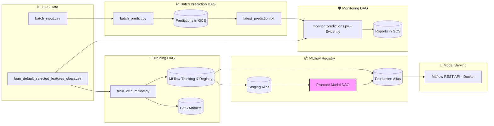
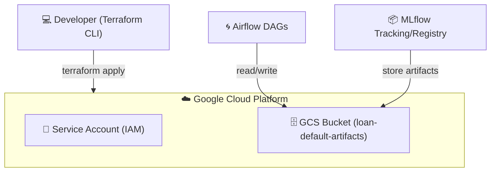

# 🏦 Loan Default Prediction – End-to-End MLOps Project

This project implements an **end-to-end MLOps pipeline** for predicting loan defaults using the [LendingClub dataset](https://www.kaggle.com/wordsforthewise/lending-club). The goal is to help financial institutions and lenders **assess borrower risk** and make more informed lending decisions.

---

## 📌 Project Overview

This project part of the **[DataTalksClub MLOps Zoomcamp](https://github.com/DataTalksClub/mlops-zoomcamp)** capstone. The solution is built with **production readiness** in mind, covering the full machine learning lifecycle:

* **Data ingestion & preprocessing** – clean, transform, and validate input loan application data.
* **Model training & experiment tracking** – train ML models (XGBoost, Logistic Regression, Random Forest), log metrics, parameters, and artifacts using **MLflow**.
* **Model registry & versioning** – manage models in **MLflow Registry**, with separate Staging and Production stages.
* **Model serving** – deploy models via **Dockerized MLflow REST API** for real-time predictions.
* **Batch inference pipeline** – schedule recurring predictions with **Apache Airflow**.
* **Monitoring & drift detection** – track data drift and target drift with **Evidently AI**, generating automated reports.
* **Infrastructure-as-Code (IaC)** – provision cloud resources using **Terraform** on GCP (Google Cloud Platform).
* **CI/CD** – enforce testing, linting, and formatting via **GitHub Actions**.

This pipeline is designed for **scalability, reproducibility, and automation**, ensuring smooth collaboration between Data Science and DevOps teams.


### Dataset

* **Source**: LendingClub Loan Dataset (public).
* **Cleaned version**: `gs://loan-default-artifacts-loan-default-mlops/data/loan_default_selected_features_clean.csv`
* **Features**: loan amount, interest rate, credit grade, revolving balance, etc.
* **Target variable**: `loan_status` (defaulted vs non-defaulted).

---
---

## 🏗️ Architecture & Tools

### High-Level Workflow



### High-Level Workflow

```mermaid 
flowchart LR
    D[📊 Data (GCS)] --> T[🧠 Training DAG]
    T --> R[📦 MLflow Registry (Staging)]
    T --> A1[📂 Artifacts to GCS]

    R --> Pm[🔄 Promote DAG]
    Pm --> Prod[📦 Registry (Production)]

    Prod --> S[🚀 Serving API]
    S --> BP[📈 Batch Predictions]

    BP --> A2[📂 Predictions to GCS]
    BP --> M[🛡️ Drift Detection (Evidently)]

    M --> A3[📑 Reports to GCS]
    M -- |drift or degrade| --> T
```

### Detailed Architecture


🔑 **Key Design Choice: Model Serving**

Instead of building a custom **FastAPI** or **Flask service**, this project leverages **MLflow’s built-in REST API** for serving models.

  ✅ **Standardized interface** → Follows MLflow’s model format and signature.

  ✅ **Less boilerplate** → No need to maintain custom inference logic.

  ✅ **CI/CD-friendly** → Integration tests directly hit the `/invocations endpoint.

  ✅ **Portable** → The same model can be served locally, in Docker, or in cloud environments without modification.

---
---

## ⚙️ Tech Stack

This project integrates **Machine Learning**, **MLOps**, and **Cloud Infrastructure** tools to deliver a production-ready loan default prediction system.

* **Programming Language**:

  * [Python 3.10+](https://www.python.org/) (core development)

* **Machine Learning & Experiment Tracking**:

  * [scikit-learn](https://scikit-learn.org/) – model training & preprocessing
  * [XGBoost](https://xgboost.readthedocs.io/) – gradient boosting models
  * [Optuna](https://optuna.org/) – hyperparameter tuning
  * [MLflow](https://mlflow.org/) – experiment tracking, model registry, and serving

* **Orchestration & Workflow Management**:

  * [Apache Airflow](https://airflow.apache.org/) – DAGs for training, batch prediction, monitoring, and promotion
  * Custom **bash scripts** (`start_all.sh`, `stop_all.sh`) for container orchestration

* **Model Monitoring & Drift Detection**:

  * [Evidently AI](https://evidentlyai.com/) – monitoring, data drift, and target drift reports

* **Infrastructure & Deployment**:

  * [Docker](https://www.docker.com/) – containerization for all services
  * [Terraform](https://www.terraform.io/) – Infrastructure as Code (IaC) on GCP
  * [Google Cloud Storage (GCS)](https://cloud.google.com/storage) – storing artifacts, reports, and batch predictions
  * [GitHub Actions](https://docs.github.com/en/actions) – CI/CD pipeline

* **Testing & Quality Assurance**:

  * [pytest](https://docs.pytest.org/) – unit and integration tests
  * [flake8](https://flake8.pycqa.org/) – linting
  * [black](https://black.readthedocs.io/) – code formatting
  * [isort](https://pycqa.github.io/isort/) – import sorting
  * [mypy](https://mypy.readthedocs.io/) – static type checking

---
---

## 📂 Repository Structure

```bash
loan_default_prediction/
├── .github/workflows/        # CI/CD pipeline (GitHub Actions)
│   └── ci.yml
├── airflow/                  # Airflow orchestration environment
│   ├── dags/                 # Training, batch prediction, monitoring DAGs
│   │   ├── train_pipeline_dag.py
│   │   ├── batch_prediction_dag.py
│   │   ├── monitoring_dag.py
│   │   └── promote_model_dag.py
│   ├── docker-compose.yaml   # Local Airflow + MLflow + GCS setup
│   ├── start_all.sh          # Start Airflow + services
│   ├── stop_all.sh           # Stop Airflow + services
│   ├── start_serve.sh        # Start MLflow serving container
│   ├── stop_serve.sh         # Stop MLflow serving container
│   ├── logs/                 # Airflow runtime logs
│   ├── artifacts/            # Airflow-local artifacts (predictions, reports)
│   └── mlruns/               # Local MLflow tracking (if not using GCS)
│
├── data/                     # Input data
│   ├── batch_input.csv       # Example batch input
│   └── sample_input.json     # Sample request for prediction API
│
├── infra/terraform/          # IaC for GCP resources
│   ├── main.tf               # Core infra definitions
│   ├── variables.tf          # Parameterized variables
│   ├── outputs.tf            # Outputs for GCS, services, etc.
│   └── terraform.tfvars      # Environment-specific variables
│
├── src/                      # Core ML code
│   ├── train_with_mlflow.py  # Train & log models with MLflow
│   ├── tune_xgboost_with_optuna.py  # Hyperparameter tuning
│   ├── train.py              # Baseline model training
│   ├── train_and_compare.py  # Compare multiple models
│   ├── batch_predict.py      # Batch inference script
│   ├── monitor_predictions.py # Drift detection & monitoring reports
│   ├── predict.py            # Local test client for serving API
│   ├── utils.py              # Shared helpers
│   └── config/               # (Optional) config files
│
├── tests/                    # Unit & integration tests
│   ├── test_utils.py
│   ├── test_prediction_integration.py
│   ├── test_batch_prediction_integration.py
│   └── conftest.py (if needed)
│
├── notebooks/                # EDA & experimentation notebooks
│
├── requirements.txt          # Core dependencies
├── requirements-dev.txt      # Dev/test dependencies
├── requirements-serve.txt    # MLflow serving dependencies
├── requirements-monitoring.txt # Evidently/monitoring dependencies
├── Dockerfile                # Base image for training/serving
├── Dockerfile.airflow        # Airflow image
├── Dockerfile.serve          # MLflow serving image
├── Dockerfile.monitor        # Monitoring image
├── Dockerfile.terraform      # Terraform-in-Docker image
├── Makefile                  # Automation for linting, tests, Airflow, Terraform
├── README.md                 # Project documentation (you are here 🚀)
├── .flake8                   # Linting config
├── pyproject.toml             # Black/isort/mypy config
├── .gitignore                # Ignored files
└── LICENSE                   # License file
```

### 🔑 Key Directories

* **`airflow/`** → Orchestrates ML pipelines via DAGs
* **`src/`** → Core ML training, prediction, monitoring scripts
* **`infra/terraform/`** → Cloud infrastructure as code (GCS buckets, service accounts, etc.)
* **`tests/`** → Unit + integration tests for reliability
* **`data/`** → Example input and sample request payloads

---
---

## ⚙️ Setup & Installation

### Clone the Repository

```bash
git clone https://github.com/JDede1/loan_default_prediction.git
cd loan_default_prediction
```

### Prerequisites

Ensure the following are installed:

* **Docker** (>= 24.0) & **Docker Compose**
* **Python** 3.10+ (if running locally outside Docker)
* **Make** (for convenience commands)
* **GCP Service Account Key** (JSON) with access to GCS

  * Save it under:

    * `keys/gcs-service-account.json` (root)
    * `airflow/keys/gcs-service-account.json` (for Airflow)


### Environment Variables

Copy the `.env` template and update with your values:

```bash
cp .env.example .env
```

Key variables:

```bash
# Airflow
AIRFLOW_UID=50000

# GCS bucket for ML artifacts
GCS_BUCKET=loan-default-artifacts-mlops
STORAGE_BACKEND=gcs

# Path to service account key inside Airflow
GOOGLE_APPLICATION_CREDENTIALS=/opt/airflow/keys/gcs-service-account.json
```

### Install Dependencies (Local Dev)

If you want to run code **outside Docker**:

```bash
# Core + Dev dependencies
make install
```

This installs:

* `requirements.txt` (core ML packages)
* `requirements-dev.txt` (linting, testing, type checking)

### Start Airflow + MLflow + GCS (via Docker)

From the repo root:

```bash
make start
```

This spins up:

* **Airflow Webserver** ([http://localhost:8080](http://localhost:8080))
* **MLflow Tracking Server** ([http://localhost:5000](http://localhost:5000))
* **MLflow Model Serving** ([http://localhost:5001](http://localhost:5001))
* **Postgres + Redis** (Airflow backend)

To stop services:

```bash
make stop
```

### Run Linting & Tests

```bash
# Check linting & formatting
make lint

# Auto-format code
make format

# Run tests
make test
```

Integration tests can also be run inside Airflow containers:

```bash
make integration-tests
```

### Terraform (GCP Infrastructure)

All infra is defined in `infra/terraform/`.
To deploy (from repo root):

```bash
make terraform-init
make terraform-plan
make terraform-apply
```

This provisions:

* GCS bucket(s) for artifacts
* Service accounts & IAM bindings

To tear down:

```bash
make terraform-destroy
```
---
---
## 🚀 Usage

This section shows how to run **training**, **serving**, **batch inference**, and **monitoring** — either via **Airflow** (recommended) or **manually** for quick local checks.

### Start the stack

From repo root:

```bash
make start
```

* Airflow UI → [http://localhost:8080](http://localhost:8080)
* MLflow UI → [http://localhost:5000](http://localhost:5000)
* Serving API → [http://localhost:5001/invocations](http://localhost:5001/invocations)

Stop everything:

```bash
make stop
```

### Run pipelines via Airflow (recommended)

Open Airflow UI → **[http://localhost:8080](http://localhost:8080)**

DAGs to run (in order):

1. **train\_model\_with\_mlflow**

   * Trains a model on GCS/local data
   * Logs metrics/artifacts to MLflow
   * Registers/updates `loan_default_model@staging`

2. **promote\_model\_dag** (optional)

   * Promotes `staging` → `production` if thresholds are met

3. **batch\_prediction\_dag**

   * Runs batch inference using the selected alias (staging/production)
   * Saves `predictions_*.csv` to GCS and updates the “latest” marker

4. **monitoring\_dag**

   * Compares training data vs latest predictions with **Evidently**
   * Saves JSON/HTML reports to artifacts (and GCS if enabled)

> Tip: You can trigger DAG runs manually in the UI or let the cron schedules handle it.


### Train locally (manual)

If you want a quick local training run (outside Airflow), you can invoke the training script:

```bash
python src/train_with_mlflow.py \
  --train_path data/loan_default_selected_features_clean.csv \
  --experiment_name loan_default_experiment \
  --register_name loan_default_model \
  --register_alias staging
```

Results:

* Run appears in **MLflow UI**
* Registered model/alias updated (if `--register_name` provided)

### Serving API (real-time inference)

The **serve** container hosts an MLflow model server bound to the **Model Registry alias**.

#### Quick curl test

```bash
curl -X POST http://localhost:5001/invocations \
  -H "Content-Type: application/json" \
  -d @data/sample_input.json
```

Expected:

```json
{"predictions": [0, 1, ...]}
```

#### Python test

```bash
python src/predict.py
```

> If you update the `staging` alias in MLflow, the **same container** will serve the new version automatically.


### Batch prediction (manual)

Generate predictions for a CSV of rows and save to a timestamped file (and GCS if configured):

```bash
python src/batch_predict.py \
  --model_name loan_default_model \
  --alias staging \
  --input_path data/batch_input.csv \
  --output_path artifacts/predictions.csv
```

Output:

* Local file like `artifacts/predictions_YYYY-MM-DD_HH-MM-SS.csv`
* Uploaded to `gs://<bucket>/predictions/...` if `STORAGE_BACKEND=gcs`

### Monitoring (manual)

Compare **training** vs **latest predictions** with Evidently:

```bash
python src/monitor_predictions.py \
  --train_data_path data/loan_default_selected_features_clean.csv \
  --prediction_path artifacts/predictions_YYYY-MM-DD_HH-MM-SS.csv
```

Outputs:

* `artifacts/monitoring_report_*.json`
* `artifacts/monitoring_report_*.html` (human-readable)

If `STORAGE_BACKEND=gcs` and `GCS_BUCKET` are set, reports are also uploaded to GCS.

### Tests

#### Unit tests (fast)

```bash
make test
```

#### Integration tests (inside Airflow container)

These hit real containers (MLflow server, model registry):

```bash
make integration-tests
```

* Ensures the **serving API** responds
* Runs **batch prediction** end-to-end

> CI (GitHub Actions) runs **lint + unit tests** on every push/PR to `main`.

### Common flows

**Full local run (with Docker):**

```bash
make start
# In Airflow UI: trigger train_model_with_mlflow
# optional: trigger promote_model_dag
# then: trigger batch_prediction_dag
# then: trigger monitoring_dag
```

**One-off quick check:**

```bash
python src/train_with_mlflow.py --register_name loan_default_model --register_alias staging
python src/batch_predict.py --model_name loan_default_model --alias staging --input_path data/batch_input.csv --output_path artifacts/preds.csv
python src/monitor_predictions.py --train_data_path data/loan_default_selected_features_clean.csv --prediction_path artifacts/preds_*.csv
```
---
---

## 🚦 CI/CD

We use **GitHub Actions** for continuous integration to ensure code quality and reliability across the project.  
Every **push** or **pull request** to the `main` branch triggers the CI pipeline, which runs the following stages:

1. **Linting & Formatting**
   * Ensures code consistency and style with **flake8**, **black**, and **isort**.

2. **Testing**
   * Runs **pytest** for unit and functional tests.
   * Integration tests (e.g., API calls to the MLflow model server) are supported and can be toggled with `RUN_INTEGRATION_TESTS`.

3. **CI Results**
   * Status is reported back to GitHub with pass/fail checks.
   * Badges in the README display the current CI status.

4. **Future CD Extensions** (Planned)
   * Automated **Docker builds** for Airflow, serving, and monitoring services.
   * Deployment to **Google Cloud Platform (GCP)** using Terraform.
   * Automatic model promotion and batch job scheduling triggered by registry updates.

---

```mermaid
flowchart TD
    A[Push/Pull Request to main] --> B[Linting & Formatting]
    B --> C[Testing]
    C --> D[CI Results Reported]
    D --> E[Badges Updated]
    D --> F[Future: Docker Builds + GCP Deployment]
````
---
---

## Infrastructure (Terraform)

This project uses **Terraform** to provision and manage Google Cloud resources required for MLflow, Airflow, and batch prediction pipelines.

### 🌍 Infrastructure Components

* **Google Cloud Storage (GCS)**

  * Stores MLflow artifacts (models, metrics, feature importance, plots, etc.)
  * Stores batch prediction outputs and monitoring reports

* **Service Account + IAM Roles**

  * Provides secure authentication for Airflow and MLflow to access GCS

* **State Management**

  * Terraform keeps track of resource configurations via `terraform.tfstate`
  * Ensures reproducible and version-controlled infrastructure

### 📂 Terraform Directory

```bash
infra/terraform/
├── main.tf              # Main configuration for GCP services
├── variables.tf         # Input variables (e.g., project_id, region, bucket_name)
├── outputs.tf           # Exported outputs (e.g., bucket URL)
├── terraform.tfvars     # Custom values for variables (gitignored)
├── terraform.tfstate    # State file (gitignored)
└── .terraform/          # Local Terraform cache (gitignored)
```

### ⚙️ Terraform Commands

All Terraform commands are wrapped in the `Makefile` for simplicity.

```bash
# Initialize Terraform
make terraform-init

# Show planned changes
make terraform-plan

# Apply changes (provision resources)
make terraform-apply

# Destroy resources
make terraform-destroy
```

### 🔐 Authentication

Terraform authenticates with GCP using the **service account key**:

* Stored at: `keys/gcs-service-account.json`
* Mounted into Airflow and MLflow containers
* Exported as environment variable:

```bash
export GOOGLE_APPLICATION_CREDENTIALS=keys/gcs-service-account.json
```

### 🏗️ Visual Overview


---
---

## Development & Contribution

We welcome contributions 🚀 to improve the project.
Follow the guidelines below to ensure consistency, code quality, and smooth collaboration.


### 🛠️ Development Setup

Clone the repository and install dependencies:

```bash
git clone https://github.com/JDede1/loan_default_prediction.git
cd loan_default_prediction

# Install core + dev dependencies
make install
```

### 📦 Code Quality

The project enforces **linting, formatting, and type checks**:

```bash
# Format code
make format

# Lint code
make lint

# Run tests
make test
```

### Tools Used

* **Black** → Python code formatting
* **isort** → Import sorting
* **Flake8** → Style guide enforcement
* **Mypy** → Static type checking
* **Pytest** → Unit & integration testing


### 🔀 Git Workflow

1. **Create a feature branch**

   ```bash
   git checkout -b feature/my-new-feature
   ```

2. **Commit changes with clear messages**

   ```bash
   git commit -m "Add feature: X with explanation"
   ```

3. **Push branch & open PR**

   ```bash
   git push origin feature/my-new-feature
   ```

4. **PR Review & Merge** → Code is reviewed before merging into `main`.

### 🧪 Testing

* Unit tests → `tests/test_utils.py`
* Integration tests → `tests/test_prediction_integration.py` & `tests/test_batch_prediction_integration.py`

To run integration tests locally:

```bash
RUN_INTEGRATION_TESTS=1 pytest -m integration -v
```

### 📜 Contribution Guidelines

* Write clear commit messages (conventional commits encouraged).
* Add/update tests for new features.
* Ensure `make lint format test` passes before submitting PR.
* Document new features in the **README** or inline code comments.

---

---

## Future Improvements

A forward-looking roadmap to strengthen robustness, scale, and MLOps maturity.

### 🔬 Modeling & Data

* **Feature store** (Feast) for consistent online/offline features.
* **Hyperparameter search at scale** (Optuna on Ray/Vertex Vizier); early stopping & pruning.
* **Model ensembling** or **stacking** (XGBoost + LightGBM + calibrated LR).
* **Bias & fairness checks** (responsible AI reports; subgroup performance).
* **Online inference features** (recent credit events, rolling aggregates via streaming).
* **Automated data quality gates** (Great Expectations checks in DAG pre-steps).

### 🛠️ Automation & Orchestration

* **Promotion policy as code**: formalize thresholds/guards in a single YAML consumed by both Airflow and CI.
* **Blue/green or canary serving**: route % traffic to the candidate model; rollback on SLO breach.
* **Backfills** and **reprocessing DAGs** with idempotent runs & data versioning (Delta/BigQuery time travel).

### 📈 Monitoring & Observability

* Expand **Evidently** coverage: target + data drift, stability, PSI, population shifts.
* **Latency & availability SLOs** for serving; alerts in Slack/Email with run links.
* Centralized logs/metrics/traces (OpenTelemetry → Grafana/Prometheus/Loki).

### ☁️ Infrastructure & Scale

* **Artifact store hardening**: signed URLs, retention tiers, inventory reports.
* **Autoscaling** for serving (KEDA/HPA) and **GPU-ready** build variants (if needed).
* **Distributed training** (Ray, Dask, or Spark) when dataset volume grows.

### 🔐 Security & Compliance

* Secrets via **GCP Secret Manager**; remove JSON keys from mounts.
* **Least-privilege service accounts**; per-environment isolation (dev/stage/prod).
* Audit trails on **model registry** changes (who/what/when) surfaced in PRs.

### 💸 Cost & Efficiency

* Storage lifecycle policies (archive → delete).
* Spot/preemptible training nodes; cache datasets & artifacts.
* CI caching (pip/pytest) and conditional workflows to avoid redundant runs.

### 🧭 Governance & Reproducibility

* **Model cards** and **data cards** published per release.
* Data & model **lineage** (OpenLineage + Marquez, or built-in with Airflow).
* **Semantic versioning** for models (e.g., `v{major.minor.patch}`) synced to registry aliases.

---

---

## 🙏 Acknowledgments

I would like to sincerely thank the following for their guidance, encouragement, and inspiration throughout the course of this project:

* **My mentors and peers**, whose feedback and discussions provided invaluable insights.
* **The broader data science and MLOps community**, for sharing knowledge and best practices that shaped my approach.
* **Family and friends**, for their unwavering support and patience during the many long hours dedicated to building and refining this project.

---