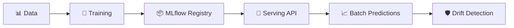
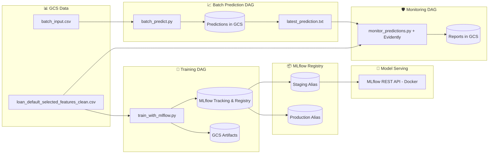

# 🏦 Loan Default Prediction – End-to-End MLOps Project

This project implements an **end-to-end MLOps pipeline** for predicting loan defaults using the [LendingClub dataset](https://www.kaggle.com/wordsforthewise/lending-club).

It was built as part of the **[DataTalksClub MLOps Zoomcamp](https://github.com/DataTalksClub/mlops-zoomcamp)** capstone. The project demonstrates how to move from a trained ML model to a **production-grade ML system** with automated retraining, deployment, monitoring, and CI/CD.

---

## 📌 Project Overview

### Problem Statement

Loan default is a major risk for financial institutions, leading to revenue loss and operational costs. This project builds a machine learning pipeline to predict the likelihood of loan default and integrates the workflow into a production-ready MLOps system.

### Dataset

* **Source**: LendingClub Loan Dataset (public).
* **Cleaned version**: `gs://loan-default-artifacts-loan-default-mlops/data/loan_default_selected_features_clean.csv`
* **Features**: loan amount, interest rate, credit grade, revolving balance, etc.
* **Target variable**: `loan_status` (defaulted vs non-defaulted).

### Objectives

This project demonstrates the full MLOps lifecycle:

✅ Train, evaluate, and register models with MLflow
✅ Automate workflows with Airflow DAGs
✅ Deploy models via Docker + MLflow REST API
✅ Daily batch prediction with Airflow
✅ Monitor drift and quality with Evidently
✅ Store artifacts in GCS (Terraform provisioned)
✅ CI/CD with GitHub Actions + testing

---

## 🏗️ Architecture & Tools

### High-Level Workflow



### Detailed Architecture


### Tech Stack

* **Cloud & IaC**: Google Cloud Storage (GCS), Terraform
* **Experiment Tracking & Registry**: MLflow
* **Orchestration**: Apache Airflow
* **Serving**: MLflow REST API (Docker)
* **Monitoring**: Evidently
* **CI/CD**: GitHub Actions
* **Testing**: Pytest (unit + integration)
* **Languages**: Python 3.9+

---

## 📂 Repository Structure

```bash
loan_default_prediction/
├── airflow/                  # Airflow env & DAGs
│   ├── dags/                 # Training, batch, monitoring, promotion DAGs
│   ├── docker-compose.yaml   # Airflow + MLflow + Serve stack
│   ├── start_all.sh          # Start services
│   └── keys/                 # GCP service account (not in repo)
├── data/                     # Training + batch data
├── infra/terraform/          # GCP infrastructure IaC
├── src/                      # Core ML + pipeline code
├── tests/                    # Unit & integration tests
├── .env                      # Environment variables
├── Makefile                  # Common commands
├── requirements*.txt         # Dependencies
├── Dockerfile*               # Service Dockerfiles
└── README.md
```

---

## ☁️ Cloud Infrastructure

Provisioned with **Terraform**:

* **Bucket**: `loan-default-artifacts-<project_id>`
* Stores: training data, batch inputs, predictions, MLflow artifacts
* Features: versioning + lifecycle rules

Auth: service account key → `/opt/airflow/keys/gcs-service-account.json`

Run:

```bash
make terraform-init
make terraform-plan
make terraform-apply
```

---

## 🎯 MLflow Tracking & Registry

* **Metrics**: AUC, F1, Precision, Recall
* **Artifacts**: ROC, confusion matrix, feature importance plots
* **Registry**:

  * Model: `loan_default_model`
  * Aliases: `staging`, `production`

UI: [http://localhost:5000](http://localhost:5000)

---

## ⚙️ Airflow Orchestration

DAGs:

1. `train_pipeline_dag.py`: weekly retraining
2. `promote_model_dag.py`: staging → production promotion
3. `batch_prediction_dag.py`: daily batch predictions → GCS
4. `monitoring_dag.py`: Evidently drift detection

UI: [http://localhost:8080](http://localhost:8080)

---

## 🚀 Model Deployment

* **Service**: MLflow REST API (Docker container)
* **Endpoint**: `http://localhost:5001/invocations`

Test locally:

```bash
curl -X POST http://localhost:5001/invocations \
  -H "Content-Type: application/json" \
  -d @data/sample_input.json
```

---

## 📊 Monitoring

* **Evidently** detects data & target drift
* Outputs reports → JSON + HTML → stored in `artifacts/`
* Extendable with alerts (Slack/Email)

---

## 🧪 Reproducibility & Best Practices

* Fully Dockerized (Airflow, MLflow, Serve, Terraform)
* Makefile automation (`make start`, `make stop`, `make integration-tests`)
* Unit + integration tests (`pytest`)
* CI/CD: GitHub Actions → lint + format + test
* Code quality: Black + Flake8

---

## 🚀 Quickstart

```bash
# 1. Clone repo
git clone https://github.com/your-username/loan_default_prediction.git
cd loan_default_prediction

# 2. Add service account key
mkdir keys && cp gcs-service-account.json keys/

# 3. Start services
make start

# 4. Provision infra
make terraform-init
make terraform-apply

# 5. Trigger DAGs via Airflow UI (http://localhost:8080)

# 6. Test API
curl -X POST http://localhost:5001/invocations \
  -H "Content-Type: application/json" \
  -d @data/sample_input.json

# 7. Stop services
make stop
```

---

## 🐛 Troubleshooting

* Airflow fails → run `docker compose -f airflow/docker-compose.yaml run --rm airflow-init`
* MLflow missing model → trigger `train_pipeline_dag`
* GCS 403 → check IAM roles on service account
* Integration tests → `make integration-tests`
* M1 Macs → add `--platform linux/amd64` when building Docker images

---

## 🔮 Future Improvements

* Streaming inference pipeline (Kafka/PubSub)
* Real-time monitoring dashboards (Grafana + Prometheus)
* Alerting workflows (Slack/Email on drift)
* Automated retraining on drift threshold violations
* Model explainability with SHAP/ELI5

---

## 🙏 Acknowledgments

Developed as part of **DataTalksClub MLOps Zoomcamp**.
Thanks to the instructors, mentors, and community for guidance and feedback.

---
