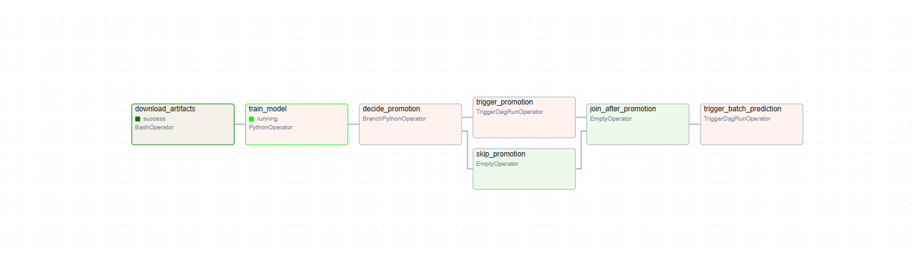
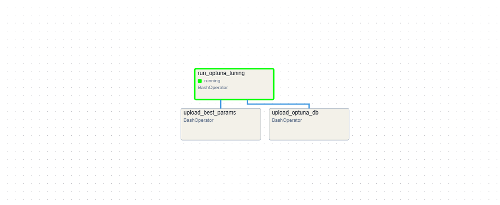
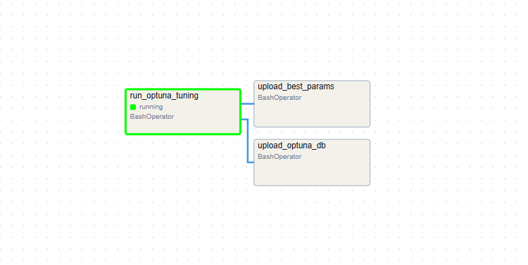
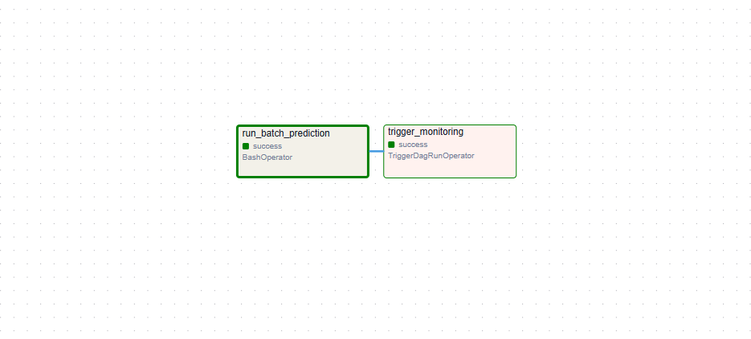
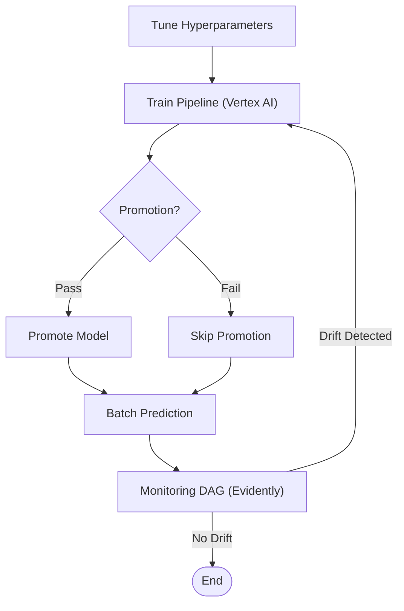
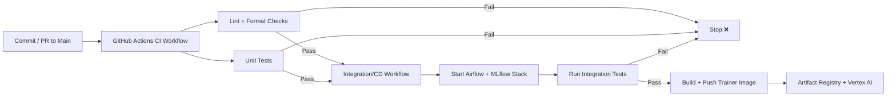
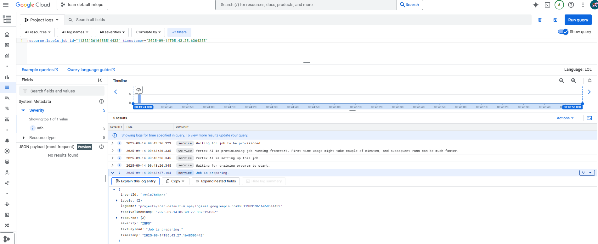
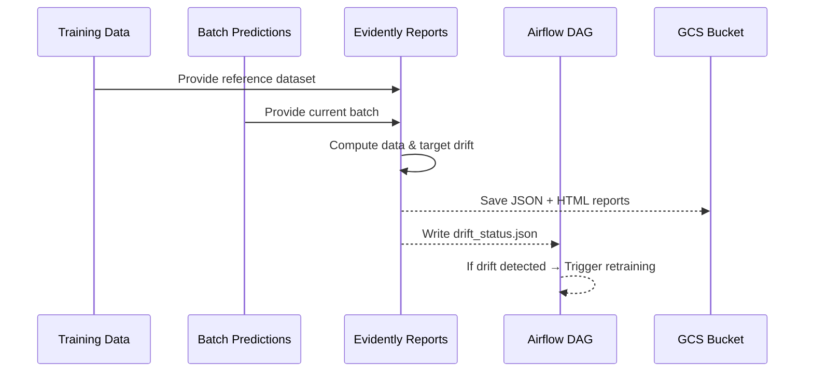

[](./LICENSE)

---


---

## 🎥 Demo

The following demo shows the **Airflow UI** with all orchestrated DAGs available:

1. **Training Pipeline DAG** – submits training jobs and logs results in MLflow.
2. **Hyperparameter Tuning DAG** – runs Optuna optimization for XGBoost.
3. **Batch Prediction DAG** – generates daily predictions.
4. **Monitoring DAG** – runs Evidently drift detection and can trigger retraining.
5. **Promotion DAG** – promotes models from staging to production.


*(GIF captured with [ScreenToGif](https://www.screentogif.com/).)*

---


---

## 📑 Table of Contents  

- [🎥 Demo](#-demo)  
- [1. Project Overview](#1-project-overview)  
- [2. Architecture](#2-architecture)  
- [3. Prerequisites](#3-prerequisites)  
- [4. Setup & Installation](#4-setup--installation)  
- [5. Repository Structure](#5-repository-structure)  
- [6. Project Components](#6-project-components)  
- [7. CI/CD Pipeline](#7-cicd-pipeline)  
- [8. Testing & Quality Checks](#8-testing--quality-checks)  
- [9. How to Run the Project](#9-how-to-run-the-project)  
- [10. Results & Monitoring](#10-results--monitoring)  
- [11. Makefile Reference](#11-makefile-reference)  
- [12. Future Improvements](#12-future-improvements)  
- [13. Security & Contributions](#13-security--contributions)  
- [14. Troubleshooting](#14-troubleshooting)  
- [15. Acknowledgments](#15--acknowledgments)  

---

# 🏦 Loan Default Prediction – End-to-End MLOps Project

## 1. Project Overview

Financial institutions face significant risk when issuing loans, as defaults can lead to major losses. Being able to **predict the likelihood of loan default** before issuing credit allows lenders to make better decisions, reduce risk exposure, and maintain healthier loan portfolios.

This project implements a **production-grade MLOps pipeline** to automate the full lifecycle of a loan default prediction model — from data preparation and training to deployment, monitoring, and continuous improvement. The pipeline is designed to be **scalable, reproducible, and cloud-native**, following best practices in modern machine learning operations.

### 🔹 Dataset

* **Source**: LendingClub loan dataset (public loan default dataset widely used in risk modeling).
* **Data Location**: Stored in GCS (`gs://loan-default-artifacts-loan-default-mlops/data/loan_default_selected_features_clean.csv`).
* **Features**: 20 predictive features including applicant financial attributes (loan amount, annual income, DTI ratio, credit history length, number of open accounts, revolving balance, etc.).
* **Target Variable**:

  * `loan_status` → Binary classification

    * `1` = Loan defaulted
    * `0` = Loan fully paid

### 🔹 Business Value

* **Risk Mitigation** – Identify high-risk loan applications early.
* **Operational Efficiency** – Automate model training, deployment, and monitoring to reduce manual effort.
* **Scalability** – Leverage cloud infrastructure to handle large-scale data and model workloads.
* **Continuous Improvement** – Monitor performance drift and trigger retraining when needed.

### 🔹 Key Capabilities

* **Training & Tuning** – Automated hyperparameter tuning with Optuna and scalable training jobs on Vertex AI.
* **Experiment Tracking & Registry** – MLflow for logging experiments, metrics, artifacts, and versioned models.
* **Deployment** – Batch and real-time model serving with Docker and Cloud Run.
* **Monitoring** – Evidently AI for detecting data drift and target drift in production.
* **CI/CD** – GitHub Actions pipelines for automated testing, integration, and deployment; local CI simulation for reproducibility.
* **Infrastructure as Code (IaC)** – Terraform for provisioning GCP resources in a consistent, reproducible manner.

### 🔹 Tech Stack

* **Orchestration** → Apache Airflow
* **Experiment Tracking & Registry** → MLflow
* **Deployment** → Docker + GCP Cloud Run
* **Monitoring** → Evidently AI
* **CI/CD** → GitHub Actions + Local CI simulation
* **Infrastructure as Code** → Terraform
* **Cloud** → Google Cloud Platform (GCS, Artifact Registry, Vertex AI, Cloud Run)

---


---

## 2. Architecture

The project is built as a **modular MLOps pipeline** where each component handles a specific part of the ML lifecycle — from data ingestion and training to deployment, monitoring, and automated retraining.

### 🔹 System Architecture

````mermaid
graph TD
    subgraph Dev ["Local Dev / Codespaces"]
        A[Developer] -->|Code + DAGs| B[Airflow + MLflow (Docker Compose)]
        A -->|Push to Repo| G[GitHub]
    end

    G[GitHub] -->|CI/CD Workflows| H[GitHub Actions]
    H -->|Provision Infra| T[Terraform]
    H -->|Build + Push| R[Artifact Registry]

    subgraph GCP ["Google Cloud Platform"]
        T --> BKT[GCS Bucket: Data, Artifacts, Reports]
        R --> CR[Cloud Run: Model Serving]
        T --> ML[MLflow Tracking Server (Cloud Run)]
        T --> VA[Vertex AI Training Jobs]
    end

    B -->|Sync Artifacts| BKT
    ML -->|Store Experiments| BKT
    CR -->|Batch Predictions| BKT
    BKT --> MON[Evidently Drift Monitoring]
    MON -->|Trigger Retrain| VA

````

> ℹ️ **Note**: MLflow appears in both environments.
> • Locally, MLflow runs in Docker Compose (alongside Airflow) for dev and testing.
> • In production, MLflow is deployed on Cloud Run with GCS as the backend store.

---

### 🔹 Component Breakdown

* **Apache Airflow**

  * Orchestrates the end-to-end ML workflows (training, tuning, batch prediction, monitoring, promotion).
  * DAGs trigger **Vertex AI jobs**, **batch predictions**, and **Evidently monitoring**.

* **MLflow**

  * Experiment tracking (metrics, artifacts, models).
  * Model registry with **Staging → Production** lifecycle.
  * Deployed both locally (Docker) and on **Cloud Run** with GCS artifact storage.

* **Docker + Cloud Run**

  * Dockerfiles for training, serving, and MLflow.
  * Models served via **Cloud Run API** for real-time predictions.

* **Google Cloud Storage (GCS)**

  * Centralized storage for:

    * Training data.
    * Model artifacts (Optuna params, metrics, plots).
    * Batch prediction outputs.
    * Evidently monitoring reports.

* **Vertex AI**

  * Runs **training jobs** using the custom trainer image.
  * Integrates with MLflow for logging experiments and registering models.

* **Evidently AI**

  * Compares training dataset with new predictions.
  * Detects **data drift** and **target drift**.
  * If drift is detected, triggers retraining via Airflow DAG.

* **Terraform**

  * Infrastructure-as-Code provisioning:

    * GCS bucket.
    * Artifact Registry.
    * MLflow Cloud Run service + IAM.
    * Networking & permissions.

* **GitHub Actions (CI/CD)**

  * **CI Pipeline**: Lint, unit tests, formatting checks.
  * **Integration Pipeline**: Full stack startup, health checks, integration tests.
  * **CD Pipeline**: Builds and pushes trainer images to Artifact Registry.

---


---

## 3. Prerequisites

To run this project locally or on the cloud, ensure you have the following tools installed:

* **Docker** → `>= 24.x`

  * [Install Docker](https://docs.docker.com/get-docker/)
* **Docker Compose** → `>= 2.x`

  * Often bundled with Docker Desktop.
* **Python** → `3.10` (recommended for compatibility)
* **Terraform** → `>= 1.5.0`

  * [Install Terraform](https://developer.hashicorp.com/terraform/downloads)
* **Google Cloud CLI (`gcloud`)** → `>= 456.x`

  * Required for authentication, Artifact Registry, and Vertex AI.
  * [Install gcloud](https://cloud.google.com/sdk/docs/install)
* **Make** (GNU Make) → `>= 4.3`

  * Pre-installed on most Linux/macOS; Windows users can install via WSL or Git Bash.

### 🔹 GCP Setup

Before running on Google Cloud:

1. Create a GCP project (e.g., `loan-default-mlops`).
2. Enable the following APIs:

   * `storage.googleapis.com`
   * `run.googleapis.com`
   * `aiplatform.googleapis.com`
   * `artifactregistry.googleapis.com`
   * `sqladmin.googleapis.com`
3. Create a **service account** with roles:

   * `roles/storage.admin`
   * `roles/artifactregistry.admin`
   * `roles/aiplatform.admin`
   * `roles/run.admin`
4. Download the service account key and place it at:

   ```
   keys/gcs-service-account.json
   airflow/keys/gcs-service-account.json
   ```

---


---

## 4. Setup & Installation

Follow the steps below to set up the project locally and prepare it for deployment to Google Cloud.

---

### 1️⃣ Clone the Repository

```bash
git clone https://github.com/your-org/loan_default_prediction.git
cd loan_default_prediction
```

---

### 2️⃣ Configure Environment Variables

Copy the example environment file and update values as needed:

```bash
cp .env.example .env
```

Key variables in `.env`:

* **GCS\_BUCKET** → GCS bucket name for storing artifacts, predictions, reports.
* **MLFLOW\_TRACKING\_URI** → MLflow tracking server URL.
* **TRAIN\_DATA\_PATH** → Path to training dataset (CSV in GCS).
* **PREDICTION\_INPUT\_PATH** → Batch input data path.
* **PREDICTION\_OUTPUT\_PATH** → Where batch predictions will be saved.
* **PROMOTION\_AUC\_THRESHOLD** → Metric threshold for auto-promotion.
* **SLACK\_WEBHOOK\_URL / ALERT\_EMAILS** → For monitoring alerts.

---

### 3️⃣ Add GCP Service Account

Create a **GCP service account** with roles:

* `roles/storage.admin`
* `roles/artifactregistry.admin`
* `roles/aiplatform.admin`
* `roles/run.admin`

Download the JSON key and place it in:

```
keys/gcs-service-account.json
airflow/keys/gcs-service-account.json
```

---

### 4️⃣ Install Dependencies

Set up Python dependencies locally (for testing and CI/CD tooling):

```bash
make install
```

This installs:

* Core ML libs (`scikit-learn`, `xgboost`, `pandas`, etc.)
* MLflow
* Evidently AI
* Dev tools (pytest, flake8, black, isort, mypy)

---

### 5️⃣ Start the Local Stack

Spin up **Airflow + MLflow + Serving API** with Docker Compose:

```bash
make start
```

Once running, access the services at:

* **Airflow UI** → [http://localhost:8080](http://localhost:8080)
* **MLflow UI** → [http://localhost:5000](http://localhost:5000)
* **Serve API** → [http://localhost:5001](http://localhost:5001)

---

### 6️⃣ Verify Setup

Run the built-in verification:

```bash
make verify
```

Expected outputs:

* Airflow version + healthy UI.
* DAGs mounted in Airflow.
* MLflow logs accessible.
* Serving API responding.

---


---

## 5. Repository Structure

The repo follows a clean structure that separates orchestration, infrastructure, source code, and CI/CD. 

### 🔹 Directory Layout

```bash
.
├── airflow/               # Airflow orchestration
│   ├── dags/              # DAGs: training, tuning, prediction, monitoring, promotion
│   ├── docker-compose.yaml# Local stack (Airflow, MLflow, DB, Serve)
│   ├── artifacts/         # Prediction outputs, Optuna params, monitoring reports (gitignored)
│   ├── logs/              # Airflow logs (gitignored)
│   ├── keys/              # Service account (gitignored)
│   └── tmp/               # Temp files (gitignored)
│
├── infra/terraform/       # Terraform IaC
│   ├── main.tf            # GCS bucket + lifecycle rules
│   ├── cloudrun.tf        # MLflow Cloud Run, Artifact Registry, IAM
│   ├── variables.tf       # Configurable variables
│   ├── outputs.tf         # Export bucket + MLflow URLs
│   ├── terraform.tfvars   # Env-specific vars (gitignored)
│   └── .terraform/        # Terraform state (gitignored)
│
├── src/                   # ML source code
│   ├── train_with_mlflow.py    # Train & log to MLflow
│   ├── tune_xgboost_with_optuna.py # Optuna tuning
│   ├── batch_predict.py         # Batch inference
│   ├── monitor_predictions.py   # Evidently drift monitoring
│   ├── predict.py               # Real-time inference
│   ├── ingest_vertex_run.py     # Ingest Vertex AI outputs
│   └── utils.py                 # Utility helpers
│
├── scripts/               # Helper scripts
│   ├── test_ci_local.sh   # Local CI/CD simulation
│   ├── troubleshoot.sh    # Diagnostics
│   └── start/stop_all.sh  # Start/stop automation
│
├── tests/                 # Unit & integration tests
│   ├── test_utils.py
│   ├── test_prediction_integration.py
│   └── test_batch_prediction_integration.py
│
├── MLflow/                # MLflow custom Docker image
│   ├── Dockerfile.mlflow
│   ├── requirements.mlflow.txt
│   └── tracking_entrypoint.sh
│
├── data/                  # Data (samples only, large data ignored)
│   ├── loan_default_selected_features_clean.csv
│   ├── batch_input.csv
│   └── sample_input.json
│
├── docs/                  # Documentation assets
│   ├── images/            # Screenshots + demo GIFs
│   │   ├── airflow_train_pipeline.gif
│   │   └── batch_prediction_dag.png
│   └── *.png              # DAG screenshots + Vertex AI logs
│
├── .github/workflows/     # GitHub Actions CI/CD
│   ├── ci.yml             # Lint + unit tests
│   └── integration-cd.yml # Integration tests + deploy
│
├── artifacts/             # MLflow + prediction artifacts (gitignored)
├── mlruns/                # Local MLflow runs (gitignored, kept in GCS in production)
├── keys/                  # Global service account key (gitignored)
├── Makefile               # One-stop automation: setup, test, deploy
├── requirements.txt       # Core dependencies
├── requirements-*.txt     # Env-specific deps (dev, serve, airflow, monitoring, vertex)
├── SECURITY_AND_CONTRIBUTING.md
├── TROUBLESHOOTING.md
└── README.md

```

---

### 🔹 What’s Ignored (via `.gitignore` and `.dockerignore`)

* **Secrets** → `.env`, `keys/`, `airflow/keys/`, `*.json` (except small samples).
* **Logs & Artifacts** → `airflow/logs/`, `mlruns/`, `artifacts/`, `predictions_*.csv`.
* **Large Data** → `data/*` (only small sample files are versioned).
* **Terraform State** → `.terraform/`, `terraform.tfstate*`, `terraform.tfvars`.
* **OS/Editor Junk** → `.DS_Store`, `.vscode/`, `.idea/`, swap files.
* **Cache** → `__pycache__/`, `.pytest_cache/`, `.coverage`.

---

## 6. Project Components

This project is composed of several modular components that work together to automate the **end-to-end ML lifecycle**.

---

### 🔹 Airflow DAGs

Airflow orchestrates the ML workflows through a set of DAGs:

* **`tune_hyperparams_dag.py`** – Runs Optuna to tune XGBoost hyperparameters, saves best parameters and study DB to GCS.
* **`train_pipeline_dag.py`** – Weekly training pipeline:

  * Submits Vertex AI training job using best params.
  * Ingests results into MLflow.
  * Decides whether to promote model (based on AUC/F1 thresholds).
  * Triggers batch prediction after training.
* **`batch_prediction_dag.py`** – Daily batch inference using the latest MLflow model alias (staging/production), saves predictions to GCS.
* **`promote_model_dag.py`** – Promotes model from staging → production in MLflow, sends Slack + email notifications.
* **`monitoring_dag.py`** – Runs Evidently drift detection daily; if drift is detected, retrains via `train_pipeline_dag`.

#### 📸 Example DAGs in Airflow UI

**Training Pipeline DAG**


**Hyperparameter Tuning DAG**  

View of the DAG in Airflow:  


Expanded view with task details:  


**Batch Prediction DAG**



---

### 🔹 MLflow Tracking & Registry

* Tracks **experiments, metrics, artifacts, and models**.
* Registry supports **staging → production promotion**.
* Backend: **Postgres (local)**, **GCS (cloud)**.

---

### 🔹 Terraform Infrastructure

* Provisions **GCS bucket** for data, artifacts, and reports.
* Creates **Artifact Registry** for trainer + MLflow images.
* Deploys **MLflow server** on Cloud Run.
* Configures IAM roles and service accounts.

---

### 🔹 Monitoring with Evidently

* Compares **training dataset** vs **latest batch predictions**.
* Generates JSON + HTML drift reports.
* Stores reports in **GCS** and triggers retraining if drift is detected.

---

### 🔹 High-Level DAG Orchestration



---


---

## 7. CI/CD Pipeline

This project follows a **two-tier CI/CD strategy**:

1. **Continuous Integration (CI)** – Run automatically on every push/PR to `main`.

   * Code quality checks (linting, formatting).
   * Unit tests (`pytest -m "not integration"`).
   * Fails fast if issues are found.

2. **Integration + Continuous Deployment (CD)** – Run manually or on `main` branch merges.

   * Spins up the full Airflow + MLflow + Serve stack inside Docker.
   * Runs **integration tests** against batch and real-time predictions.
   * If successful → builds & pushes trainer image to Artifact Registry.

3. **Local CI Simulation** – Developers can replicate the same pipeline locally with `make ci-local`.

   * Runs lint, formatting, unit tests.
   * Spins up containers, checks health, runs integration tests.
   * Optional local CD (`make deploy-trainer`).

---

### 🔹 CI/CD Flow Diagram



---

### 🔹 GitHub Actions Workflows

* **`ci.yml`**

  * Trigger: push/PR to `main`.
  * Steps:

    * Install dependencies.
    * Check formatting (`black`, `isort`).
    * Lint (`flake8`).
    * Run unit tests only.

* **`integration-cd.yml`**

  * Trigger: manual (`workflow_dispatch`) or after integration passes.
  * Steps:

    * Build Docker images.
    * Start Postgres + Airflow + MLflow.
    * Health checks for services.
    * Bootstrap MLflow with dummy model.
    * Run integration tests (batch + real-time).
    * If on `main` → build & push trainer image to Artifact Registry.

---

### 🔹 Local CI/CD Simulation

Run the entire CI/CD process locally:

```bash
make ci-local
```

This executes `scripts/test_ci_local.sh`, which:

* Runs lint + formatting checks.
* Runs unit tests.
* Spins up Postgres + Airflow + MLflow.
* Ensures MLflow DB exists.
* Starts stack, checks health.
* Boots a dummy model in MLflow.
* Starts Serve API.
* Runs integration tests.
* Optional: deploy trainer image with `CD=1 make ci-local`.

---


---

## 8. Testing & Quality Checks

Ensuring code quality and reproducibility is a critical part of the pipeline. This project enforces **multiple levels of testing and static analysis**.

---

### 🔹 Unit Tests

* Located in `tests/`.
* Lightweight checks for utility functions and components.
* Example:

  * `tests/test_utils.py` → verifies utility functions like `add_numbers()`.

Run unit tests only:

```bash
pytest -m "not integration" -v
```

---

### 🔹 Integration Tests

* Validate the **end-to-end pipeline** inside the Airflow + MLflow stack.
* Test scenarios include:

  * **Batch prediction test** (`test_batch_prediction_integration.py`) → ensures batch inference runs and saves predictions.
  * **Real-time prediction test** (`test_prediction_integration.py`) → checks Serve API responds with valid predictions.

Run integration tests locally:

```bash
make integration-tests
```

These tests are also executed in **GitHub Actions** via the `integration-cd.yml` workflow.

---

### 🔹 Linting

* Enforced via **Flake8**.
* Ensures Python code adheres to **PEP8** and project style guidelines.

```bash
make lint
```

---

### 🔹 Code Formatting

* **Black** – auto-formats code to consistent style.
* **isort** – ensures consistent import ordering.

Check formatting (CI/CD safe):

```bash
make check-format
```

Format automatically:

```bash
make format
```

---

### 🔹 Type Checking

* Enforced via **mypy**.
* Ensures static typing coverage in source code.

```bash
mypy src
```

---

### 🔹 Coverage & Reports

* **pytest-cov** enabled in dev dependencies.
* Generates test coverage reports locally:

```bash
pytest --cov=src tests/
```
---

With these checks in place, the project guarantees:

* Code correctness (unit tests).
* Pipeline reliability (integration tests).
* Consistent style (lint/format).
* Type safety (mypy).
* Maintainability and reproducibility (coverage).

---


---

## 9. How to Run the Project

The project can be run in two modes:

1. **Locally with Docker Compose** – for development and testing.
2. **On Google Cloud (production-ready)** – with Terraform-managed infrastructure.

---

### 🔹 Run Locally (Dev Mode)

1. **Start the full stack** (Airflow + MLflow + Serve):

   ```bash
   make start
   ```

2. **Access services**:

   * Airflow → [http://localhost:8080](http://localhost:8080)
   * MLflow → [http://localhost:5000](http://localhost:5000)
   * Serve API → [http://localhost:5001](http://localhost:5001)

3. **Run unit + integration tests**:

   ```bash
   make test               # unit tests
   make integration-tests  # integration tests inside containers
   ```

4. **Trigger Airflow DAGs manually**:

   * Open Airflow UI (`localhost:8080`).
   * Enable and run DAGs:

     * `tune_hyperparams_dag`
     * `train_pipeline_dag`
     * `batch_prediction_dag`
     * `monitoring_dag`

---

### 🔹 Run on GCP (Production Mode)

1. **Provision infrastructure with Terraform**:

   ```bash
   make terraform-init
   make terraform-apply
   ```

   This creates:

   * GCS bucket (for data, artifacts, reports).
   * Artifact Registry (for trainer + MLflow images).
   * Cloud Run MLflow service.
   * IAM service accounts + permissions.

2. **Verify outputs**:
   Terraform will print:

   * `bucket_url` → where artifacts are stored.
   * `mlflow_url` → Cloud Run endpoint for MLflow tracking server.

3. **Build and push trainer image**:

   ```bash
   make trainer
   ```

   This builds the `loan-default-trainer` image and pushes it to Artifact Registry.

4. **Run training on Vertex AI** (via Airflow `train_pipeline_dag`):

   * Airflow submits a Vertex AI training job using the trainer image.
   * Results are ingested into MLflow automatically.

5. **Batch predictions**:

   * Airflow runs `batch_prediction_dag`.
   * Predictions are written to:

     ```
     gs://<your-bucket>/predictions/predictions.csv
     ```

6. **Monitoring & retraining**:

   * Airflow runs `monitoring_dag`.
   * Evidently compares training vs latest predictions.
   * Drift reports are stored in GCS under:

     ```
     gs://<your-bucket>/reports/
     ```
   * If drift detected → `train_pipeline_dag` is triggered automatically.

---

### 🔹 Tear Down GCP Infrastructure

When you’re done, destroy resources to avoid costs:

```bash
make terraform-destroy
```

---


---

## 10. Results & Monitoring

This section highlights the **outputs of the ML pipeline** and how monitoring ensures continuous model performance.

---

### 🔹 Hyperparameter Tuning (Optuna)

* The DAG `tune_hyperparams_dag` runs **Optuna** to optimize XGBoost hyperparameters.

* Best params are saved to:

  * Local: `airflow/artifacts/best_xgb_params.json`
  * GCS: `gs://<bucket>/artifacts/best_xgb_params.json`

* Example:

```json
{
  "max_depth": 7,
  "learning_rate": 0.12,
  "n_estimators": 350,
  "subsample": 0.85,
  "colsample_bytree": 0.75
}
```

---

### 🔹 Model Training & Registry (MLflow)

* Models are trained weekly via `train_pipeline_dag` on **Vertex AI**.
* Runs are logged in **MLflow** with:

  * Metrics: `AUC`, `F1`, `Precision`, `Recall`.
  * Artifacts: feature importance plots, confusion matrix, ROC curves.
  * Model versions: promoted from **staging → production** if thresholds met (`AUC ≥ 0.75`).

**MLflow UI (local):** [http://localhost:5000](http://localhost:5000)
**MLflow UI (cloud):** `<mlflow_url>` from Terraform outputs

#### 📸 Example: Vertex AI Training Logs



---

### 🔹 Batch Predictions

* Generated daily by `batch_prediction_dag`.
* Predictions written to:

```bash
gs://<bucket>/predictions/predictions.csv
```

* A marker file tracks latest prediction path:

```bash
airflow/artifacts/latest_prediction.json
```

---

### 🔹 Monitoring (Evidently AI)

* Drift reports generated daily by `monitoring_dag`.
* Compares **training data** vs **latest predictions**.
* Outputs both JSON + HTML reports:

```bash
gs://<bucket>/reports/monitoring_report_<timestamp>.json
gs://<bucket>/reports/monitoring_report_<timestamp>.html
```

* Example drift report metrics:

  * **Data Drift** → % of features with distribution shift.
  * **Target Drift** → Stability of loan default predictions over time.

---

### 🔹 Monitoring Feedback Loop



---


---

## 11. Makefile Reference

The project uses a **Makefile** to automate common developer and CI/CD tasks. Below are the most important targets grouped by purpose.

---

### 🔹 Setup & Development

* `install` → Install project and dev dependencies.
* `lint` → Run **flake8** for linting.
* `format` → Auto-format code with **black** + **isort**.
* `check-format` → Verify formatting without changing files.
* `test` → Run **unit tests** with pytest.

---

### 🔹 Stack Management (Airflow + MLflow)

* `start` → Start the full Airflow + MLflow + Serve stack.
* `stop` → Stop all services (containers paused).
* `down` → Stop and remove containers + networks.
* `start-core` → Start only core services (Postgres, Airflow webserver + scheduler, MLflow).
* `stop-core` → Stop core services.
* `stop-hard` → Full clean-up (containers, volumes, logs, artifacts).

---

### 🔹 Model Serving

* `start-serve` → Start the model serving API.
* `stop-serve` → Stop serving API.
* `restart-serve` → Restart serving API.

---

### 🔹 CI/CD & Tests

* `integration-tests` → Run integration tests inside Airflow/MLflow containers.
* `ci-local` → Run local CI/CD simulation (`scripts/test_ci_local.sh`).

---

### 🔹 Terraform (GCP Infra)

* `terraform-init` → Initialize Terraform.
* `terraform-plan` → Preview infrastructure changes.
* `terraform-apply` → Apply Terraform plan (create/update infra).
* `terraform-destroy` → Tear down all provisioned resources.

---

### 🔹 Reset & Debugging

* `reset` → Reset stack (rebuild using cached layers).
* `fresh-reset` → Reset stack with no cache (force rebuild).
* `verify` → Verify health of Airflow + MLflow + Serve.
* `troubleshoot` → Run diagnostics (logs, health checks, variables).

---

### 🔹 Build & Deployment

* `build-trainer` → Build Vertex AI trainer Docker image.
* `push-trainer` → Push trainer image to Artifact Registry.
* `trainer` → Build + push trainer image (shortcut).
* `deploy-trainer` → Build + push trainer, set image URI in Airflow.
* `build-mlflow` → Build custom MLflow Docker image.
* `bootstrap-all` → Full rebuild: MLflow + trainer + Airflow stack.

---


---

## 12. Future Improvements

While the current pipeline is production-ready, there are several enhancements that can make it more **robust, scalable, and enterprise-grade**:

---

### 🔹 Automation & Retraining

* Automate full **continuous retraining** loop with Airflow:

  * Drift detection → retrain → evaluate → promote → redeploy.
* Add **canary deployment strategy** for new models (A/B testing before full promotion).

---

### 🔹 Monitoring & Alerts

* Integrate **WhyLogs** or **Prometheus + Grafana** for richer monitoring.
* Add **real-time drift detection** on streaming data, not just batch.
* Expand **alerting integrations** (Slack, email, PagerDuty) beyond the current Airflow notifications.

---

### 🔹 Cloud-Native Enhancements

* Expand **Vertex AI Pipelines** integration to orchestrate end-to-end workflows natively on GCP.
* Deploy serving API with **GKE (Kubernetes)** or **Vertex AI Prediction** for scale-out serving.
* Store logs/metrics in **BigQuery** for auditing and analysis.

---

### 🔹 Data & Feature Management

* Integrate with a **Feature Store** (e.g., Feast) for consistent offline/online feature parity.
* Add **data versioning** (DVC or Delta Lake) for reproducibility.

---

### 🔹 Testing & CI/CD

* Expand test coverage with:

  * Load tests for prediction API.
  * Chaos tests for Airflow resilience.
  * End-to-end regression suites.
* Enable **scheduled nightly CI runs** with smoke tests against staging environment.

---

### 🔹 Developer Experience

* Add **pre-commit hooks** for lint/format checks before commits.
* Publish **Docker images** (trainer, MLflow, monitor) to a public registry for faster onboarding.
* Expand documentation in a `/docs` folder with DAG-specific diagrams and usage guides.

---


---

## 13. Security & Contributions

This project follows security best practices:

* **Secrets** (GCP keys, `.env`) are **not committed to git** (enforced via `.gitignore`).
* **Service accounts** are scoped with least privilege (`roles/storage.admin`, `roles/aiplatform.admin`, etc.).
* **Terraform** provisions infra in a reproducible, auditable way.

For detailed contribution guidelines and security reporting, see:
👉 [SECURITY\_AND\_CONTRIBUTING.md](./SECURITY_AND_CONTRIBUTING.md)

---


---

## 14. Troubleshooting

Common issues and quick fixes:

* **Airflow logs directory not writable**

  ```bash
  make fix-perms
  ```

* **MLflow volume permissions issue**

  ```bash
  make fix-mlflow-volume
  ```

* **Reset full stack (cached build)**

  ```bash
  make reset
  ```

* **Reset full stack (no cache)**

  ```bash
  make fresh-reset
  ```

* **Verify services are running**

  ```bash
  make verify
  ```

For a **comprehensive list of real-world error messages and fixes (with exact stack traces)**, see:
👉 [TROUBLESHOOTING.md](./TROUBLESHOOTING.md)

---


---

## 15. Acknowledgments

I would like to sincerely thank the following for their guidance, encouragement, and inspiration throughout the course of this project:

* **The DataTalks.Club mentors and peers** — their instructions and feedback provided invaluable insights.
* **The broader Data Science and MLOps community** — for sharing knowledge and best practices that shaped my approach.
* **Family and friends** — for their unwavering support and patience during the many long hours dedicated to building and refining this project.

---