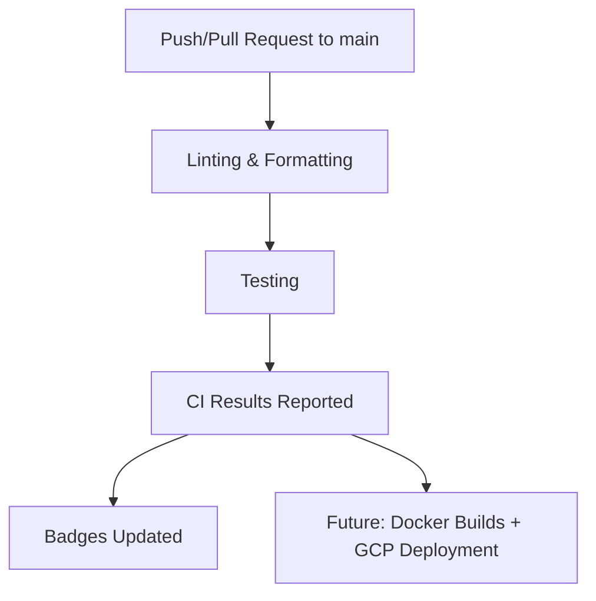

---
# 🏦 Loan Default Prediction – End-to-End MLOps Project

This project implements an **end-to-end MLOps pipeline** for predicting loan defaults using the [LendingClub dataset](https://www.kaggle.com/wordsforthewise/lending-club). The goal is to help financial institutions and lenders **assess borrower risk** and make more informed lending decisions.
---


---
## ✅Capstone Evaluation Criteria Mapping

This project meets the **DataTalksClub MLOps Zoomcamp** capstone requirements:

* **Problem description** → Clear business use case: loan default prediction.
* **Cloud (GCP + Terraform)** → Infrastructure provisioned with IaC (`infra/terraform`).
* **Experiment tracking & registry** → MLflow (tracking, artifacts, registry, model aliases).
* **Workflow orchestration** → Apache Airflow DAGs (training, batch prediction, monitoring, promotion).
* **Model deployment** → Dockerized MLflow REST API serving models from registry aliases.
* **Model monitoring** → Evidently AI for drift detection, automated reports.
* **Reproducibility** → Makefile, pinned dependencies, `.env`, and Terraform ensure reproducibility.
* **Best practices** → Unit + integration tests, linting, formatting, type checking, Makefile, CI/CD (GitHub Actions).
---


---
## 📌 Project Overview

The pipeline covers the full machine learning lifecycle:

* **Data ingestion & preprocessing** – clean, transform, validate input loan data.
* **Model training & experiment tracking** – XGBoost, Logistic Regression, Random Forest, tracked with **MLflow**.
* **Model registry & versioning** – MLflow Staging/Production with alias promotion DAG.
* **Model serving** – Dockerized MLflow REST API for real-time inference.
* **Batch inference pipeline** – automated via **Airflow DAGs**.
* **Monitoring & drift detection** – Evidently AI reports for data/target drift.
* **Infrastructure-as-Code (IaC)** – GCP resources provisioned with **Terraform**.
* **CI/CD** – Linting, testing, and integration checks with **GitHub Actions**.

> ℹ️ **Note**: Airflow DAGs are the main orchestration method. Manual commands are included for debugging/quick checks.
---


---
## 📊Dataset

* **Source**: LendingClub Loan Dataset (public via Kaggle).
* **Cleaned version**: `gs://loan-default-artifacts-loan-default-mlops/data/loan_default_selected_features_clean.csv`
* **Features**: loan amount, interest rate, credit grade, revolving balance, etc.
* **Target variable**: `loan_status` (defaulted vs non-defaulted).
---


---
## 🏗️ Architecture & Tools

### High-Level Workflow

```mermaid
flowchart LR

    subgraph Training
        D[📊 Data GCS] --> T[🧠 Training DAG]
        T --> A1[📂 Artifacts to GCS]
    end

    subgraph Registry
        T --> R[📦 MLflow Registry Staging]
        R --> Pm[🔄 Promote DAG]
        Pm --> Prod[📦 Registry Production]
    end

    subgraph Serving
        Prod --> S[🚀 Serving API]
        S --> BP[📈 Batch Predictions]
        BP --> A2[📂 Predictions to GCS]
    end

    subgraph Monitoring
        BP --> M[🛡️ Drift Detection Evidently]
        M --> A3[📑 Reports to GCS]
        M -- |drift detected| --> T
    end
```


### Detailed Architecture

```mermaid
flowchart LR
    subgraph Data["📊 GCS Data"]
        A[loan_default_selected_features_clean.csv]
        B[batch_input.csv]
    end

    subgraph Training["🧠 Training DAG"]
        A --> T1[train_with_mlflow.py]
        T1 --> MLflow[(MLflow Tracking & Registry)]
        T1 --> Artifacts[(GCS Artifacts)]
    end

    subgraph Registry["📦 MLflow Registry"]
        MLflow --> Staging[(Staging Alias)]
        MLflow --> Production[(Production Alias)]
        Promote[Promote Model DAG]:::dag
        Staging --> Promote --> Production
    end

    subgraph Serving["🚀 Model Serving"]
        Production --> API["MLflow REST API - Docker"]
    end

    subgraph Batch["📈 Batch Prediction DAG"]
        B --> P1[batch_predict.py]
        P1 --> Predictions[(Predictions in GCS)]
        Predictions --> Marker[latest_prediction.txt]
    end

    subgraph Monitoring["🛡️ Monitoring DAG"]
        Marker --> M1[monitor_predictions.py + Evidently]
        A --> M1
        M1 --> Reports[(Reports in GCS)]
    end

    classDef dag fill:#f9f,stroke:#333,stroke-width:2px;
```


**Key Design Choice: Model Serving**
Instead of building a custom **FastAPI/Flask app**, this project uses **MLflow’s REST API** for serving:

* Standardized interface
* Less boilerplate
* CI/CD-friendly (integration tests hit `/invocations`)
* Portable (local, Docker, or cloud)
---


---
## 📦 Tech Stack

This project integrates **Machine Learning**, **MLOps**, and **Cloud Infrastructure** tools to deliver a production-ready loan default prediction system.

* **Programming Language**:

  * [Python 3.10+](https://www.python.org/) (core development)

* **Machine Learning & Experiment Tracking**:

  * [scikit-learn](https://scikit-learn.org/) – model training & preprocessing
  * [XGBoost](https://xgboost.readthedocs.io/) – gradient boosting models
  * [Optuna](https://optuna.org/) – hyperparameter tuning
  * [MLflow](https://mlflow.org/) – experiment tracking, model registry, and serving

* **Orchestration & Workflow Management**:

  * [Apache Airflow](https://airflow.apache.org/) – DAGs for training, batch prediction, monitoring, and promotion
  * Custom **bash scripts** (`start_all.sh`, `stop_all.sh`) for container orchestration

* **Model Monitoring & Drift Detection**:

  * [Evidently AI](https://evidentlyai.com/) – monitoring, data drift, and target drift reports

* **Infrastructure & Deployment**:

  * [Docker](https://www.docker.com/) – containerization for all services
  * [Terraform](https://www.terraform.io/) – Infrastructure as Code (IaC) on GCP
  * [Google Cloud Storage (GCS)](https://cloud.google.com/storage) – storing artifacts, reports, and batch predictions
  * [GitHub Actions](https://docs.github.com/en/actions) – CI/CD pipeline

* **Testing & Quality Assurance**:

  * [pytest](https://docs.pytest.org/) – unit and integration tests
  * [flake8](https://flake8.pycqa.org/) – linting
  * [black](https://black.readthedocs.io/) – code formatting
  * [isort](https://pycqa.github.io/isort/) – import sorting
  * [mypy](https://mypy.readthedocs.io/) – static type checking
---


---
## 📂 Repository Structure

```bash
loan_default_prediction/
├── .github/workflows/          # CI/CD workflows (GitHub Actions)
│   ├── ci.yml                  # Linting + unit tests
│   └── ci-integration.yml      # Full stack integration tests
│
├── airflow/                    # Airflow orchestration stack
│   ├── dags/                   # Training, prediction, monitoring, promotion DAGs
│   │   ├── train_pipeline_dag.py
│   │   ├── batch_prediction_dag.py
│   │   ├── monitoring_dag.py
│   │   └── promote_model_dag.py
│   ├── artifacts/              # Local artifacts (predictions, reports)
│   ├── mlruns/                 # Local MLflow tracking (if not using GCS)
│   ├── logs/                   # Airflow runtime logs
│   ├── keys/                   # GCP service account (mounted inside Airflow)
│   ├── docker-compose.yaml     # Airflow + MLflow + Postgres stack
│   ├── start_all.sh / stop_all.sh
│   ├── start_serve.sh / stop_serve.sh
│   └── troubleshoot.sh         # Debugging helper
│
├── src/                        # Core ML code
│   ├── train_with_mlflow.py    # Train & log models with MLflow
│   ├── tune_xgboost_with_optuna.py  # Hyperparameter tuning
│   ├── batch_predict.py        # Batch inference
│   ├── monitor_predictions.py  # Drift detection with Evidently
│   ├── predict.py              # Test client for serving API
│   ├── train.py                # Baseline training
│   ├── train_and_compare.py    # Train + compare multiple models
│   └── utils.py                # Shared helpers
│
├── infra/terraform/            # IaC for GCP resources
│   ├── main.tf / variables.tf / outputs.tf
│   └── terraform.tfvars        # Environment-specific config
│
├── tests/                      # Unit & integration tests
│   ├── test_utils.py
│   ├── test_prediction_integration.py
│   └── test_batch_prediction_integration.py
│
├── data/                       # Example input data
│   ├── batch_input.csv
│   └── sample_input.json
│
├── notebooks/                  # EDA & experimentation notebooks
├── artifacts/                  # Local artifacts (predictions, reports, plots)
├── mlruns/                     # MLflow experiment runs (local)
├── docker/                     # Docker-related configs (if any)
├── keys/                       # GCP service account (outside Airflow too)
│
├── requirements.txt            # Core dependencies
├── requirements-dev.txt        # Dev/test dependencies
├── requirements-serve.txt      # MLflow serving dependencies
├── requirements-monitoring.txt # Evidently monitoring dependencies
│
├── Dockerfile*                 # Docker images (training, Airflow, serving, monitoring, Terraform)
├── Makefile                    # Automation (lint, test, Airflow, Terraform)
├── pyproject.toml              # Formatter/type checker configs
├── pytest.ini                  # Pytest configuration
├── terraform.sh                # Helper for Terraform commands
├── LICENSE
└── README.md
```

### Key Directories

* **`airflow/`** → DAGs and orchestration stack
* **`src/`** → Core ML training, prediction, monitoring scripts
* **`infra/terraform/`** → Cloud infrastructure as code
* **`tests/`** → Unit & integration tests
* **`data/`** → Sample input payloads
* **`artifacts/`** → Predictions, monitoring reports, plots
---


---
## ⚙️ Setup & Installation

### Clone the Repository

```bash
git clone https://github.com/JDede1/loan_default_prediction.git
cd loan_default_prediction
```

### Prerequisites

Ensure the following are installed:

* **Docker** (>= 24.0) & **Docker Compose**
* **Python** 3.10+ (if running locally outside Docker)
* **Make** (for convenience commands)
* **GCP Service Account Key** (JSON) with access to GCS

  * Save it under:

    * `keys/gcs-service-account.json` (root)
    * `airflow/keys/gcs-service-account.json` (for Airflow)


### Environment Variables

Copy the `.env` template and update with your values:

```bash
cp .env.example .env
```

Key variables:

```bash
# Airflow
AIRFLOW_UID=50000

# GCS bucket for ML artifacts
GCS_BUCKET=loan-default-artifacts-mlops
STORAGE_BACKEND=gcs

# Path to service account key inside Airflow
GOOGLE_APPLICATION_CREDENTIALS=/opt/airflow/keys/gcs-service-account.json
```

### Install Dependencies (Local Dev)

If you want to run code **outside Docker**:

```bash
# Core + Dev dependencies
make install
```

This installs:

* `requirements.txt` (core ML packages)
* `requirements-dev.txt` (linting, testing, type checking)

### Start Airflow + MLflow + GCS (via Docker)

From the repo root:

```bash
make start
```

This spins up:

* **Airflow Webserver** ([http://localhost:8080](http://localhost:8080))
* **MLflow Tracking Server** ([http://localhost:5000](http://localhost:5000))
* **MLflow Model Serving** ([http://localhost:5001](http://localhost:5001))
* **Postgres** (Airflow backend)

To stop services:

```bash
make stop
```

### Helper Scripts

The `airflow/` folder includes lower-level scripts (wrapped by the `make` commands above):

* `start_all.sh` / `stop_all.sh` → Manage Airflow + MLflow stack
* `start_serve.sh` / `stop_serve.sh` → Manage serving container
* `troubleshoot.sh` → Debug services

Use `make` whenever possible. Direct script calls are mostly for debugging.

### Helper Commands (recommended)

Most workflows can be run via `make` targets:

| Command             | Description                                                                                                 |
| ------------------- | ----------------------------------------------------------------------------------------------------------- |
| `make start`        | Start **Airflow + MLflow** stack                                                                            |
| `make start-serve`  | Start **MLflow model serving API** ([http://localhost:5001/invocations](http://localhost:5001/invocations)) |
| `make stop-serve`   | Stop only the serving container                                                                             |
| `make stop`         | Stop all services (Airflow, MLflow, serving, Postgres)                                                      |
| `make troubleshoot` | Run diagnostic checks (logs, permissions, health)                                                           |


### Run Linting & Tests

```bash
make lint      # flake8
make format    # black + isort
make test      # unit tests
make integration-tests  # inside containers
```

### Terraform (GCP Infrastructure)

All infra is defined in `infra/terraform/`.
To deploy (from repo root):

```bash
make terraform-init
make terraform-plan
make terraform-apply
make terraform-destroy
```
```bash
# terraform.tfvars
project_id   = "your-gcp-project-id"
region       = "us-central1"
bucket_name  = "loan-default-artifacts-mlops"
```
---


---
## 🚀 Usage

This section shows how to run **training**, **serving**, **batch inference**, and **monitoring** — either via **Airflow** (recommended) or **manually** for quick local checks.

### Start the stack

From repo root:

```bash
make start
```

* Airflow UI → [http://localhost:8080](http://localhost:8080)
* MLflow UI → [http://localhost:5000](http://localhost:5000)
* Serving API → [http://localhost:5001/invocations](http://localhost:5001/invocations)

Stop everything:

```bash
make stop
```

### Run pipelines via Airflow (recommended)

Open Airflow UI → **[http://localhost:8080](http://localhost:8080)**

DAGs to run (in order):

1. **train\_model\_with\_mlflow**

   * Trains a model on GCS/local data
   * Logs metrics/artifacts to MLflow
   * Registers/updates `loan_default_model@staging`

2. **promote\_model\_dag** (optional)

   * Promotes `staging` → `production` if thresholds are met

3. **batch\_prediction\_dag**

   * Runs batch inference using the selected alias (staging/production)
   * Saves `predictions_*.csv` to GCS and updates the “latest” marker

4. **monitoring\_dag**

   * Compares training data vs latest predictions with **Evidently**
   * Saves JSON/HTML reports to artifacts (and GCS if enabled)

> Tip: You can trigger DAG runs manually in the UI or let the cron schedules handle it.

### Train locally (manual)

If you want a quick local training run (outside Airflow), you can invoke the training script:

```bash
python src/train_with_mlflow.py \
  --train_path data/loan_default_selected_features_clean.csv \
  --experiment_name loan_default_experiment \
  --register_name loan_default_model \
  --register_alias staging
```

Results:

* Run appears in **MLflow UI**
* Registered model/alias updated (if `--register_name` provided)

### Serving API (real-time inference)

The **serve** container hosts an MLflow model server bound to the **Model Registry alias**.

Start serving:

```bash
make start-serve
```

#### Quick curl test

```bash
curl -X POST http://localhost:5001/invocations \
  -H "Content-Type: application/json" \
  -d @data/sample_input.json
```

Expected:

```json
{"predictions": [0, 1, ...]}
```

#### Python test

```bash
python src/predict.py
```

> If you update the `staging` alias in MLflow, the **same container** will serve the new version automatically.

Stop serving:
```bash
make stop-serve
```

### Batch prediction (manual)

Generate predictions for a CSV of rows and save to a timestamped file (and GCS if configured):

```bash
python src/batch_predict.py \
  --model_name loan_default_model \
  --alias staging \
  --input_path data/batch_input.csv \
  --output_path artifacts/predictions.csv
```

Output:

* Local file like `artifacts/predictions_YYYY-MM-DD_HH-MM-SS.csv`
* Uploaded to `gs://<bucket>/predictions/...` if `STORAGE_BACKEND=gcs`

### Monitoring (manual)

Compare **training** vs **latest predictions** with Evidently:

```bash
python src/monitor_predictions.py \
  --train_data_path data/loan_default_selected_features_clean.csv \
  --prediction_path artifacts/predictions_YYYY-MM-DD_HH-MM-SS.csv
```

Outputs:

* `artifacts/monitoring_report_*.json`
* `artifacts/monitoring_report_*.html` (human-readable)

If `STORAGE_BACKEND=gcs` and `GCS_BUCKET` are set, reports are also uploaded to GCS.

### Tests

#### Unit tests (fast)

```bash
make test
```

#### Integration tests (inside Airflow container)

These hit real containers (MLflow server, model registry):

```bash
make integration-tests
```

* Ensures the **serving API** responds
* Runs **batch prediction** end-to-end

> CI (GitHub Actions) runs **lint + unit tests** on every push/PR to `main`.

### Common flows

**Full local run (with Docker):**

```bash
make start
# In Airflow UI: trigger train_model_with_mlflow
# optional: trigger promote_model_dag
# then: trigger batch_prediction_dag
# then: trigger monitoring_dag
```

**One-off quick check:**

```bash
python src/train_with_mlflow.py --register_name loan_default_model --register_alias staging
python src/batch_predict.py --model_name loan_default_model --alias staging --input_path data/batch_input.csv --output_path artifacts/preds.csv
python src/monitor_predictions.py --train_data_path data/loan_default_selected_features_clean.csv --prediction_path artifacts/preds_*.csv
```
---


---
## 🔄 CI/CD

* **ci.yml** → unit tests + lint on every push/PR.
* **ci-integration.yml** → spins up full stack (Airflow + MLflow + serving) and runs integration tests.


---


---
## ☁️ Infrastructure (Terraform)

This project uses **Terraform** to provision and manage Google Cloud resources required for MLflow, Airflow, and batch prediction pipelines.

### Infrastructure Components

* **Google Cloud Storage (GCS)**

  * Stores MLflow artifacts (models, metrics, feature importance, plots, etc.)
  * Stores batch prediction outputs and monitoring reports

* **Service Account + IAM Roles**

  * Provides secure authentication for Airflow and MLflow to access GCS

* **State Management**

  * Terraform keeps track of resource configurations via `terraform.tfstate`
  * Ensures reproducible and version-controlled infrastructure

### Terraform Directory

```bash
infra/terraform/
├── main.tf              # Main configuration for GCP services
├── variables.tf         # Input variables (e.g., project_id, region, bucket_name)
├── outputs.tf           # Exported outputs (e.g., bucket URL)
├── terraform.tfvars     # Custom values for variables (gitignored)
├── terraform.tfstate    # State file (gitignored)
└── .terraform/          # Local Terraform cache (gitignored)
```

### Terraform Commands

All Terraform commands are wrapped in the `Makefile` for simplicity.

```bash
# Initialize Terraform
make terraform-init

# Show planned changes
make terraform-plan

# Apply changes (provision resources)
make terraform-apply

# Destroy resources
make terraform-destroy
```

### Authentication

Terraform authenticates with GCP using the **service account key**:

* Stored at: `keys/gcs-service-account.json`
* Mounted into Airflow and MLflow containers
* Exported as environment variable:

```bash
export GOOGLE_APPLICATION_CREDENTIALS=keys/gcs-service-account.json
```

### Visual Overview

```mermaid
flowchart TD
    subgraph GCP["☁️ Google Cloud Platform"]
        SA["🔑 Service Account (IAM)"]
        GCS["🗄️ GCS Bucket (loan-default-artifacts)"]
    end

    Dev["💻 Developer (Terraform CLI)"] -->|terraform apply| GCP
    Airflow["🌀 Airflow DAGs"] -->|read/write| GCS
    MLflow["📦 MLflow Tracking/Registry"] -->|store artifacts| GCS
```


---


---
## 🧑‍💻 Development & Contribution

We welcome contributions to improve the project.
Follow the guidelines below to ensure consistency, code quality, and smooth collaboration.

### Development Setup

Clone the repository and install dependencies:

```bash
git clone https://github.com/JDede1/loan_default_prediction.git
cd loan_default_prediction

# Install core + dev dependencies
make install
```

### Code Quality

The project enforces **linting, formatting, and type checks**:

```bash
# Format code
make format

# Lint code
make lint

# Run tests
make test
```

### Tools Used

* **Black** → Python code formatting
* **isort** → Import sorting
* **Flake8** → Style guide enforcement
* **Mypy** → Static type checking
* **Pytest** → Unit & integration testing


### Git Workflow

1. **Create a feature branch**

   ```bash
   git checkout -b feature/my-new-feature
   ```

2. **Commit changes with clear messages**

   ```bash
   git commit -m "Add feature: X with explanation"
   ```

3. **Push branch & open PR**

   ```bash
   git push origin feature/my-new-feature
   ```

4. **PR Review & Merge** → Code is reviewed before merging into `main`.

### Testing

* Unit tests → `tests/test_utils.py`
* Integration tests → `tests/test_prediction_integration.py` & `tests/test_batch_prediction_integration.py`

To run integration tests locally:

```bash
RUN_INTEGRATION_TESTS=1 pytest -m integration -v
```

### Contribution Guidelines

* Write clear commit messages (conventional commits encouraged).
* Add/update tests for new features.
* Ensure `make lint format test` passes before submitting PR.
* Document new features in the **README** or inline code comments.
---


---
## 📈 Future Improvements

A forward-looking roadmap to strengthen robustness, scale, and MLOps maturity.

### Modeling & Data

* **Feature store** (Feast) for consistent online/offline features.
* **Hyperparameter search at scale** (Optuna on Ray/Vertex Vizier); early stopping & pruning.
* **Model ensembling** or **stacking** (XGBoost + LightGBM + calibrated LR).
* **Bias & fairness checks** (responsible AI reports; subgroup performance).
* **Online inference features** (recent credit events, rolling aggregates via streaming).
* **Automated data quality gates** (Great Expectations checks in DAG pre-steps).

### Automation & Orchestration

* **Promotion policy as code**: formalize thresholds/guards in a single YAML consumed by both Airflow and CI.
* **Blue/green or canary serving**: route % traffic to the candidate model; rollback on SLO breach.
* **Backfills** and **reprocessing DAGs** with idempotent runs & data versioning (Delta/BigQuery time travel).

### Monitoring & Observability

* Expand **Evidently** coverage: target + data drift, stability, PSI, population shifts.
* **Latency & availability SLOs** for serving; alerts in Slack/Email with run links.
* Centralized logs/metrics/traces (OpenTelemetry → Grafana/Prometheus/Loki).

### Infrastructure & Scale

* **Artifact store hardening**: signed URLs, retention tiers, inventory reports.
* **Autoscaling** for serving (KEDA/HPA) and **GPU-ready** build variants (if needed).
* **Distributed training** (Ray, Dask, or Spark) when dataset volume grows.

### Security & Compliance

* Secrets via **GCP Secret Manager**; remove JSON keys from mounts.
* **Least-privilege service accounts**; per-environment isolation (dev/stage/prod).
* Audit trails on **model registry** changes (who/what/when) surfaced in PRs.

### Cost & Efficiency

* Storage lifecycle policies (archive → delete).
* Spot/preemptible training nodes; cache datasets & artifacts.
* CI caching (pip/pytest) and conditional workflows to avoid redundant runs.

### Governance & Reproducibility

* **Model cards** and **data cards** published per release.
* Data & model **lineage** (OpenLineage + Marquez, or built-in with Airflow).
* **Semantic versioning** for models (e.g., `v{major.minor.patch}`) synced to registry aliases.
---


---

## 🙏 Acknowledgments

I would like to sincerely thank the following for their guidance, encouragement, and inspiration throughout the course of this project:

* **The Datatalks.club mentors and peers**, whose feedback and discussions provided invaluable insights.
* **The broader data science and MLOps community**, for sharing knowledge and best practices that shaped my approach.
* **Family and friends**, for their unwavering support and patience during the many long hours dedicated to building and refining this project.

---