# 🏦 Loan Default Prediction – End-to-End MLOps Project

This project implements an **end-to-end MLOps pipeline** for predicting loan defaults using the [LendingClub dataset](https://www.kaggle.com/wordsforthewise/lending-club).

It was built as part of the **DataTalksClub MLOps Zoomcamp capstone** and demonstrates how to move from a trained ML model to a **production-grade ML system** with automated retraining, deployment, monitoring, and CI/CD.

---

## 📌 Project Overview

### Problem Statement

Loan default is a major risk for financial institutions, leading to revenue loss and operational costs. This project builds a machine learning pipeline to predict the likelihood of loan default and integrates the workflow into a production-ready MLOps system.

### Dataset

* **Source**: LendingClub Loan Dataset (public).
* **Cleaned version**: `gs://loan-default-artifacts-loan-default-mlops/data/loan_default_selected_features_clean.csv`.
* **Features**: loan amount, interest rate, credit grade, revolving balance, etc.
* **Target variable**: `loan_status` (defaulted vs non-defaulted).

### Objectives

This project demonstrates the full MLOps lifecycle:
✅ Train, evaluate, and register models with MLflow
✅ Automate workflows with Airflow DAGs
✅ Deploy models via Docker + MLflow REST API
✅ Daily batch prediction with Airflow
✅ Monitor drift and quality with Evidently
✅ Store artifacts in GCS (Terraform provisioned)
✅ CI/CD with GitHub Actions + testing

---

## 🏗️ Architecture & Tools

### High-Level Workflow

```mermaid
flowchart LR
    Data[📊 Data] --> Training[🧠 Training]
    Training --> Registry[📦 MLflow Registry]
    Registry --> Serving[🚀 Serving API]
    Serving --> Prediction[📈 Batch Predictions]
    Prediction --> Monitoring[🛡️ Drift Detection]
```



### Detailed Architecture

```mermaid
flowchart LR
    subgraph Data["📊 GCS Data"]
        A[loan_default_selected_features_clean.csv]
        B[batch_input.csv]
    end
    subgraph Training["🧠 Training DAG"]
        A --> T1[train_with_mlflow.py]
        T1 --> MLflow[(MLflow Tracking & Registry)]
        T1 --> Artifacts[(GCS Artifacts)]
    end
    subgraph Registry["📦 MLflow Registry"]
        MLflow --> Staging[(Staging Alias)]
        MLflow --> Prod[(Production Alias)]
    end
    subgraph Serving["🚀 Model Serving"]
        Staging --> API[MLflow REST API (Docker)]
    end
    subgraph Batch["📈 Batch Prediction DAG"]
        B --> P1[batch_predict.py]
        P1 --> Predictions[(Predictions in GCS)]
        Predictions --> Marker[latest_prediction.txt]
    end
    subgraph Monitoring["🛡️ Monitoring DAG"]
        Marker --> M1[monitor_predictions.py (Evidently)]
        A --> M1
        M1 --> Reports[(Reports in GCS)]
    end
```

### Technologies

* **Cloud & IaC**: Google Cloud (GCS), Terraform
* **Tracking & Registry**: MLflow
* **Orchestration**: Apache Airflow
* **Serving**: MLflow REST API (Docker)
* **Monitoring**: Evidently
* **CI/CD**: GitHub Actions
* **Testing**: Pytest (unit + integration)

---

## 📂 Project Structure

```bash
loan_default_prediction/
├── airflow/                  # Airflow env & DAGs
│   ├── dags/                 # Training, batch, monitoring, promotion DAGs
│   ├── docker-compose.yaml   # Airflow + MLflow + Serve stack
│   ├── start_all.sh          # Start services
│   ├── stop_all.sh           # Stop services
│   └── keys/                 # GCP service account (not in repo)
├── data/                     # Training + batch data
│   ├── loan_default_selected_features_clean.csv
│   └── batch_input.csv
├── infra/terraform/          # GCP infrastructure IaC
│   ├── main.tf variables.tf outputs.tf terraform.tfvars
├── model/                    # MLflow-managed models
├── src/                      # Core code
│   ├── train_with_mlflow.py
│   ├── batch_predict.py
│   ├── monitor_predictions.py
│   └── utils.py
├── tests/                    # Unit & integration tests
│   ├── test_utils.py
│   ├── test_batch_prediction_integration.py
│   └── test_prediction_integration.py
├── .env                      # Environment variables
├── Makefile                  # Common commands
├── requirements*.txt         # Dependencies
├── Dockerfile*               # Service Dockerfiles
└── README.md
```

> 🔑 Notes

* Secrets (service account keys) are never committed.
* `mlruns/` and `artifacts/` are runtime only (in `.gitignore`).
* Full system reproducible with `make start` + `make terraform-apply`.

---

## ☁️ Cloud Infrastructure

* **Terraform** creates GCS bucket: `loan-default-artifacts-<project_id>`

  * Stores training data, batch inputs, predictions, MLflow artifacts.
  * Versioning + lifecycle (auto-delete after 30 days).
* **Auth**: GCP service account key mounted at `/opt/airflow/keys/gcs-service-account.json`.
* **Fallback**: If no GCP, runs fully local (`mlruns/`, `artifacts/`).

Commands:

```bash
make terraform-init
make terraform-plan
make terraform-apply
make terraform-destroy
```

---

## 🎯 MLflow Tracking & Registry

* **Tracking**: Logs AUC, F1, Precision, Recall + artifacts (ROC, feature importance).
* **Artifacts**: GCS (cloud) or `./mlruns/` (local).
* **Registry**:

  * Model name: `loan_default_model`
  * Aliases: `staging` (candidates), `production` (live)
* **Integration**: Training DAG logs to MLflow, Promotion DAG updates aliases.

Access: [http://localhost:5000](http://localhost:5000)

---

## ⚙️ Orchestration with Airflow

DAGs:

1. `train_model_with_mlflow`: weekly retrain & log.
2. `promote_model_dag`: move `staging` → `production` if thresholds met.
3. `batch_prediction_dag`: daily predictions to GCS.
4. `monitoring_dag`: daily Evidently drift reports.

Access: [http://localhost:8080](http://localhost:8080)

---

## 🚀 Deployment

* **Service**: `serve` container (MLflow REST API).
* **Endpoint**: `http://localhost:5001/invocations`.

Test:

```bash
curl -X POST http://localhost:5001/invocations \
  -H "Content-Type: application/json" \
  -d @data/sample_input.json
```

---

## 📊 Monitoring

* **Evidently** checks drift between training & predictions.
* Reports stored in GCS.
* Alerts extendable (Slack/Email).

---

## 🧪 Reproducibility & Best Practices

* **All Dockerized** (Airflow, MLflow, Serving, Terraform).
* **Makefile automation** (`make start`, `make stop`, `make integration-tests`).
* **Testing**: Unit + integration tests with pytest.
* **CI/CD**: GitHub Actions (lint, tests).
* **Code quality**: Flake8 + Black.

---

## 📌 Evaluation Mapping (Zoomcamp Rubric)

✅ Problem description → 4
✅ Cloud (Terraform + GCP) → 4
✅ Tracking + Registry (MLflow) → 4
✅ Orchestration (Airflow) → 4
✅ Deployment (MLflow Serving) → 4
✅ Monitoring (Evidently) → 4
✅ Reproducibility (Docker, IaC, Makefile) → 4
✅ Best practices (tests, CI/CD, structure) → 4

**Expected: full points (4 in all categories).**

---

## 🚀 Quickstart

```bash
# 1. Clone
git clone https://github.com/your-username/loan_default_prediction.git
cd loan_default_prediction

# 2. Keys
mkdir keys && cp gcs-service-account.json keys/

# 3. Start services
make start

# 4. Provision infra
make terraform-init
make terraform-apply

# 5. Trigger DAGs in Airflow UI (http://localhost:8080)

# 6. Test API
curl -X POST http://localhost:5001/invocations \
  -H "Content-Type: application/json" \
  -d @data/sample_input.json

# 7. Stop services
make stop
```

---
---

## 🐛 Known Issues & Troubleshooting

Even with Dockerized reproducibility, some common issues may appear. Below are quick fixes:

### 1. **Airflow containers fail to start**

* **Symptom**: `airflow-webserver` or `airflow-scheduler` crash immediately.
* **Fix**: Ensure the database is initialized:

  ```bash
  docker compose -f airflow/docker-compose.yaml run --rm airflow-init
  ```

  Then restart services:

  ```bash
  make start
  ```

---

### 2. **MLflow registry not accessible**

* **Symptom**: `mlflow.exceptions.RestException: NOT_FOUND: No registered model`
* **Fix**: Train & register at least one model via Airflow DAG `train_model_with_mlflow`.

---

### 3. **GCS upload errors**

* **Symptom**: `403: The caller does not have storage.objects.create access`
* **Fix**:

  * Ensure the service account JSON key is present at `keys/gcs-service-account.json`.
  * The account must have **Storage Admin** or equivalent role.
  * Verify authentication inside a container:

    ```bash
    gcloud auth activate-service-account --key-file=/opt/airflow/keys/gcs-service-account.json
    gsutil ls gs://<your-bucket>
    ```

---

### 4. **Integration tests fail (`ModuleNotFoundError: src`)**

* **Fix**: Run tests with `PYTHONPATH=/opt/airflow`:

  ```bash
  make integration-tests
  ```

---

### 5. **Airflow webserver stuck with old DAGs**

* **Fix**: Clear volume caches:

  ```bash
  docker compose -f airflow/docker-compose.yaml down -v
  make start
  ```

---

### 6. **Docker build errors (`platform mismatch`)**

* **Symptom**: `exec format error` on M1/M2 Mac.
* **Fix**: Force amd64 build:

  ```bash
  docker compose -f airflow/docker-compose.yaml build --platform linux/amd64
  ```

---

### 7. **Evidently monitoring reports not generated**

* **Fix**: Ensure both:

  * Training dataset is available in GCS (`loan_default_selected_features_clean.csv`).
  * Batch prediction DAG has produced at least one `predictions_*.csv`.

---

### 8. **Terraform errors (`quota`, `API not enabled`)**

* **Fix**:

  * Enable required APIs:

    ```bash
    gcloud services enable storage.googleapis.com
    ```
  * Re-run:

    ```bash
    make terraform-init
    make terraform-apply
    ```

---

⚠️ If all else fails, reset the environment:

```bash
docker compose -f airflow/docker-compose.yaml down -v
make stop
make start
```

---

---

🙏 **Acknowledgements**
Developed as part of **DataTalksClub MLOps Zoomcamp**.
Thanks to the instructors, mentors, and community for guidance and feedback.

---
