[](https://github.com/JDede1/loan_default_prediction/actions/workflows/ci.yml)

<!--
[](https://github.com/JDede1/loan_default_prediction/actions/workflows/ci-integration.yml)
-->

# 🏦 Loan Default Prediction – End-to-End MLOps Project

This project implements an **end-to-end MLOps pipeline** for predicting loan defaults using the [LendingClub dataset](https://www.kaggle.com/wordsforthewise/lending-club). The goal is to help financial institutions and lenders **assess borrower risk** and make more informed lending decisions.


---
## ✅Capstone Evaluation Criteria Mapping

This project meets the **DataTalksClub MLOps Zoomcamp** capstone requirements:

* **Problem description** → Clear business use case: loan default prediction.
* **Cloud (GCP + Terraform)** → Infrastructure provisioned with IaC (`infra/terraform`).
* **Experiment tracking & registry** → MLflow (tracking, artifacts, registry, model aliases).
* **Workflow orchestration** → Apache Airflow DAGs (training, batch prediction, monitoring, promotion).
* **Model deployment** → Dockerized MLflow REST API serving models from registry aliases.
* **Model monitoring** → Evidently AI for drift detection, automated reports.
* **Reproducibility** → Makefile, pinned dependencies, `.env`, and Terraform ensure reproducibility.
* **Best practices** → Unit + integration tests, linting, formatting, type checking, Makefile, CI/CD (GitHub Actions).
---


---
## 📌 Project Overview

The pipeline covers the full machine learning lifecycle:

* **Data ingestion & preprocessing** – clean, transform, validate input loan data.
* **Model training & experiment tracking** – XGBoost, Logistic Regression, Random Forest, tracked with **MLflow**.
* **Model registry & versioning** – MLflow Staging/Production with alias promotion DAG.
* **Model serving** – Dockerized MLflow REST API for real-time inference.
* **Batch inference pipeline** – automated via **Airflow DAGs**.
* **Monitoring & drift detection** – Evidently AI reports for data/target drift.
* **Infrastructure-as-Code (IaC)** – GCP resources provisioned with **Terraform**.
* **CI/CD** – Linting, testing, and integration checks with **GitHub Actions**.

> ℹ️ **Note**: Airflow DAGs are the main orchestration method. Manual commands are included for debugging/quick checks.
---


---
## 📊 Dataset

* **Source:** LendingClub Loan Dataset (public via Kaggle).
* **Target:** `loan_status` (binary: default vs. non-default).
* **Storage (single, consistent bucket):** `gs://loan-default-artifacts-loan-default-mlops/`

**Canonical paths**

* **Training data:**
  `gs://loan-default-artifacts-loan-default-mlops/data/loan_default_selected_features_clean.csv`
* **Batch input (example):**
  `gs://loan-default-artifacts-loan-default-mlops/data/batch_input.csv`
* **Local samples (for quick runs/tests):**
  `data/batch_input.csv`, `data/sample_input.json`

**Schema expectations**

* Features must match the columns used during training (see `data/sample_input.json` for request shape and `data/batch_input.csv` for column order).
* If you add/remove features, **retrain** and **re-register** the model so the serving signature and batch pipeline stay consistent.

**Repro tips**

* Keep the cleaned training CSV immutable; write derived artifacts (predictions, reports) to separate prefixes:

  * Predictions → `gs://loan-default-artifacts-loan-default-mlops/predictions/...`
  * Monitoring reports → `gs://loan-default-artifacts-loan-default-mlops/reports/...`

---


---
## 🏗️ Architecture & Tools

### High-Level Workflow

```mermaid
flowchart LR

    subgraph Training
        D[📊 Data GCS] --> T[🧠 Training DAG]
        T --> A1[📂 Artifacts to GCS]
    end

    subgraph Registry
        T --> R[📦 MLflow Registry Staging]
        R --> Pm[🔄 Promote DAG]
        Pm --> Prod[📦 Registry Production]
    end

    subgraph Serving
        Prod --> S[🚀 Serving API]
        S --> BP[📈 Batch Predictions]
        BP --> A2[📂 Predictions to GCS]
    end

    subgraph Monitoring
        BP --> M[🛡️ Drift Detection Evidently]
        M --> A3[📑 Reports to GCS]
        M -- |drift detected| --> T
    end
```


### Detailed Architecture

```mermaid
flowchart LR
    subgraph Data["📊 GCS Data"]
        D1[loan_default_selected_features_clean.csv]
        D2[batch_input.csv]
    end

    subgraph Train["🧠 Airflow: train_pipeline_dag"]
        D1 --> T[train_with_mlflow.py]
        T --> ML[(MLflow Tracking)]
        T --> ART[(Artifacts → GCS)]
        ML --> REG[(MLflow Model Registry)]
        REG -->|alias=staging| STG[Staging]
    end

    subgraph Promote["🔄 Airflow: promote_model_dag"]
      STG --> PRD[Production]
    end

    subgraph Serve["🚀 MLflow REST (Docker)"]
      PRD --> S[/ /invocations /]
    end

    subgraph Batch["📈 Airflow: batch_prediction_dag"]
        D2 --> BP[batch_predict.py]
        BP --> PRED[(Predictions → GCS)]
    end

    subgraph Monitor["🛡️ Airflow: monitoring_dag"]
        PRED --> MON[monitor_predictions.py + Evidently]
        D1 --> MON
        MON --> RPT[(HTML/JSON Reports → GCS)]
        MON -- drift? --> T
    end

    classDef dag fill:#f9f,stroke:#333,stroke-width:2px;
```


**Key design choice — MLflow Serving (no custom API):**

* Serve **by alias** (`staging` / `production`) from the **Model Registry**.
* Zero app code to maintain; standard `/invocations` contract.
* Works the same locally, in CI, or on Kubernetes.

### Tooling (consistent & pinned)

* **ML lifecycle**

  * **MLflow 3.1.4** — tracking, registry, artifacts, serving
  * **scikit-learn / XGBoost** — modeling
  * *(Optional)* **Optuna** — add only if you use tuning (pin in requirements)

* **Orchestration**

  * **Apache Airflow 2.8.1 (Py3.10)** — four DAGs:

    * `train_pipeline_dag`
    * `promote_model_dag`
    * `batch_prediction_dag`
    * `monitoring_dag`

* **Monitoring**

  * **Evidently** — drift/quality reports (HTML/JSON) stored in GCS

* **Infra / Packaging**

  * **Docker** — containers for Airflow, MLflow, Serving, Terraform
  * **Terraform** — GCP resources (bucket, SA, IAM)
  * **GCS** — artifact store, predictions, reports

* **DevEx / Quality**

  * **Makefile** — one-liners (start/stop/lint/test/terraform)
  * **pytest, flake8, black, isort, mypy**
  * **GitHub Actions** — CI (lint + unit; optional integration)

### Service boundaries

| Component       | Responsibility                                     | Notes                       |
| --------------- | -------------------------------------------------- | --------------------------- |
| Airflow         | Schedule & run data/train/batch/monitor/promote    | Uses env + GCS SA key mount |
| MLflow server   | Experiments, registry, artifact URIs               | Backed by GCS artifact root |
| Serve container | Exposes `/invocations` using **MODEL\_NAME/ALIAS** | Health at `/ping`           |
| Terraform       | Creates bucket + IAM                               | Run via Make targets        |
| GCS             | Single source for artifacts/predictions/reports    | Keep bucket name consistent |

**Aliases drive everything**: change `MODEL_ALIAS` → restart serving → traffic points at the new version, no code edits.

---


---
## 📦 Tech Stack

**Language**

* **Python 3.10**

**ML & Tracking**

* **scikit-learn**, **XGBoost**
* **MLflow 3.1.4** (single version across: tracking server, clients, and `requirements.serve.txt`)

  * Experiments, Model Registry (aliases), and REST serving
* *(Optional)* **Optuna** for HPO

  * If used, ensure `optuna` is added to `requirements.txt` (pinned); otherwise omit

**Orchestration**

* **Apache Airflow 2.8.1 (Py3.10)**

  * DAGs: `train_pipeline_dag`, `promote_model_dag`, `batch_prediction_dag`, `monitoring_dag`
  * Google provider for GCS interactions

**Monitoring**

* **Evidently** for data/target drift and quality reports (HTML/JSON), stored in GCS

**Infrastructure & Packaging**

* **Docker** images: Airflow, MLflow, Serving, Terraform
* **Terraform** for GCP (bucket, service account, IAM)
* **Google Cloud Storage (GCS)** for artifacts, predictions, reports

**DevEx & Quality**

* **Makefile** (start/stop, lint, test, terraform)
* **pytest**, **flake8**, **black**, **isort**, **mypy**
* **GitHub Actions** CI (lint + unit; optional integration)

---


---
## 📂 Repository Structure (updated)

```bash
loan_default_prediction/
├── .github/
│   └── workflows/
│       ├── ci.yml
│       └── ci-integration.yml
│
├── airflow/                          # Orchestration stack
│   ├── dags/
│   │   ├── train_pipeline_dag.py
│   │   ├── batch_prediction_dag.py
│   │   ├── monitoring_dag.py
│   │   └── promote_model_dag.py
│   ├── docker-compose.yaml           # Airflow + MLflow + Postgres + Serve + Terraform
│   ├── start_all.sh / stop_all.sh
│   ├── start_serve.sh / stop_serve.sh
│   └── troubleshoot.sh
│   # (generated at runtime; keep gitignored)
│   # airflow-logs/ , logs/ , mlruns/ , artifacts/ , keys/
│
├── src/
│   ├── train_with_mlflow.py
│   ├── train.py
│   ├── train_and_compare.py
│   ├── tune_xgboost_with_optuna.py   # optional; include optuna in requirements if used
│   ├── batch_predict.py
│   ├── monitor_predictions.py
│   ├── predict.py
│   ├── utils.py
│   └── config/                       # present in repo (project-specific configs)
│
├── infra/
│   └── terraform/
│       ├── main.tf
│       ├── variables.tf
│       ├── outputs.tf
│       └── terraform.tfvars.example  # template; real tfvars is gitignored
│
├── tests/
│   ├── test_utils.py
│   ├── test_prediction_integration.py
│   └── test_batch_prediction_integration.py
│
├── data/
│   ├── batch_input.csv
│   └── sample_input.json
│
├── notebooks/                        # optional
├── docker/                           # present in repo (aux configs/scripts if any)
├── artifacts/                        # generated; keep gitignored
├── mlruns/                           # generated; keep gitignored
│
├── entrypoint.sh                     # serving entrypoint (reads MODEL_NAME/MODEL_ALIAS)
├── Dockerfile.airflow
├── Dockerfile.serve
├── Dockerfile.monitor
├── Dockerfile.terraform
│
├── requirements.txt
├── requirements-dev.txt
├── requirements.serve.txt
├── requirements-monitoring.txt
│
├── Makefile
├── .env.example                      # template; real .env is gitignored
├── .flake8
├── pyproject.toml
├── pytest.ini
├── LICENSE
└── README.md
```

**Generated/ignored paths (should not be committed):**
`airflow/airflow-logs/`, `airflow/logs/`, `airflow/mlruns/`, `artifacts/`, `mlruns/`, `infra/terraform/.terraform/`, `infra/terraform/terraform.tfstate*`, `.pytest_cache/`, `keys/gcs-service-account.json`, `.env`

**Legacy/unneeded paths (safe to remove if present):**
`Dockerfile.airflow_legacy_DO_NOT_USE.`, `airflow/gs:`, duplicate `.github/.github/`

---


---

## ⚙️ Setup & Installation

### 1) Prerequisites

* **Docker** (24+)
* **Docker Compose**
* **Make**
* **Python 3.10+** (only if you also want to run scripts locally)
* A **GCP Service Account key (JSON)** with access to your GCS bucket (artifacts, predictions, reports)

> ✅ This project uses real GCS (not a local emulator). Ensure your bucket exists and the SA has the right permissions.


### 2) Clone the repository

```bash
git clone https://github.com/JDede1/loan_default_prediction.git
cd loan_default_prediction
```


### 3) Environment variables (safe template)

Copy the template and fill in placeholders (keep your real `.env` **out of Git**):

```bash
cp .env.example .env
```

Minimum keys to set in `.env`:

```bash
# Airflow
AIRFLOW_UID=50000
AIRFLOW__CORE__FERNET_KEY=REPLACE_WITH_NEW_FERNET_KEY
AIRFLOW__WEBSERVER__SECRET_KEY=REPLACE_WITH_NEW_SECRET_KEY

# GCP / GCS
GOOGLE_CLOUD_PROJECT=YOUR_PROJECT_ID
GCS_BUCKET=YOUR_BUCKET_NAME
GOOGLE_APPLICATION_CREDENTIALS=/opt/airflow/keys/gcs-service-account.json

# MLflow (model naming)
MODEL_NAME=loan_default_model
MODEL_ALIAS=staging
```

Generate fresh keys (recommended):

```bash
# Fernet key
python -c "from cryptography.fernet import Fernet; print(Fernet.generate_key().decode())"

# Webserver secret
openssl rand -hex 32
```

> Keep **bucket names and paths consistent** across `.env`, Terraform, and any hard-coded examples.


### 4) Place your GCP key (single location)

Put the SA key at:

```
keys/gcs-service-account.json   # (gitignored)
```

Docker Compose will mount it into containers at:

```
/opt/airflow/keys/gcs-service-account.json
```

> You do **not** need to duplicate it under `airflow/keys/`; the compose file handles the mount.


### 5) (Optional) Local Python dependencies

If you want to run scripts locally (outside Docker):

```bash
make install   # installs requirements.txt + requirements-dev.txt
```


### 6) Start core services (Airflow + MLflow + Postgres)

From the repo root:

```bash
make start
```

* Airflow UI: [http://localhost:8080](http://localhost:8080)
* MLflow UI:  [http://localhost:5000](http://localhost:5000)

> This **does not** start model serving. Serving is a separate container (next step).


### 7) Start model serving (separate container)

```bash
make start-serve
# health check
curl -sS http://localhost:5001/ping
```

* Serving API: [http://localhost:5001/invocations](http://localhost:5001/invocations)
* The serving container resolves the model via **MLflow Model Registry** using:

  * `MODEL_NAME` (e.g., `loan_default_model`)
  * `MODEL_ALIAS` (e.g., `staging` or `production`)

To switch to Production later, update your alias (in `.env` or compose) and restart serving:

```bash
# MODEL_ALIAS=production
make stop-serve && make start-serve
```


### 8) Stop services

```bash
make stop-serve   # stops only the serving container
make stop         # stops Airflow, MLflow, Postgres, etc.
```


### 9) Troubleshooting

```bash
make troubleshoot
# or view logs
docker compose -f airflow/docker-compose.yaml logs -f webserver scheduler mlflow
```


### 10) Services quick reference

| Service       | URL                                            | How to start       |
| ------------- | ---------------------------------------------- | ------------------ |
| Airflow       | [http://localhost:8080](http://localhost:8080) | `make start`       |
| MLflow UI     | [http://localhost:5000](http://localhost:5000) | `make start`       |
| Model Serving | [http://localhost:5001](http://localhost:5001) | `make start-serve` |

---


---

## ⚡ Quickstart (Train → Serve → Predict)

### 1) Start core services

```bash
make start
# Airflow UI → http://localhost:8080
# MLflow UI  → http://localhost:5000
```

### 2) Train & register the model (Airflow)

In the Airflow UI, trigger this DAG in order:

1. **`train_pipeline_dag`**

   * Logs runs to MLflow
   * Registers/updates **`loan_default_model@staging`**

> Tip: In MLflow UI → “Models” you should see `loan_default_model` with alias **staging**.

### 3) Start model serving (alias-driven)

```bash
make start-serve
curl -sS http://localhost:5001/ping   # expect HTTP 200
```

* Serving API: `POST http://localhost:5001/invocations`

### 4) Send a sample prediction

Using the provided JSON:

```bash
curl -X POST http://localhost:5001/invocations \
  -H "Content-Type: application/json" \
  -d @data/sample_input.json
```

Or Python client:

```bash
python src/predict.py
```

### 5) (Optional) Promote to Production

In Airflow UI, run **`promote_model_dag`** to set alias:

* `staging` → `production`

Then restart serving to pick up the alias change:

```bash
# Ensure MODEL_ALIAS=production (in .env or docker-compose)
make stop-serve && make start-serve
```

### 6) Batch predict & monitor (Airflow)

* **`batch_prediction_dag`** → scores `data/batch_input.csv`, writes predictions to artifacts/GCS.
* **`monitoring_dag`** → generates Evidently drift reports; alerts/triggered actions per thresholds.

### 7) Stop services

```bash
make stop-serve   # serving only
make stop         # Airflow, MLflow, Postgres, etc.
```
---


---
## 🚀 Usage

### Overview

Use **Airflow DAGs** for production-like runs. Use **manual commands** only for quick local checks. Serving is a **separate container** from the core stack.


### A) Run pipelines via Airflow (recommended)

Open the Airflow UI → **[http://localhost:8080](http://localhost:8080)** and trigger in this order:

1. **`train_pipeline_dag`**
   Trains the model, logs runs to MLflow, and updates **`loan_default_model@staging`** in the Model Registry.

2. **`promote_model_dag`** (optional)
   Applies your promotion policy and flips alias **staging → production** when thresholds pass.

3. **`batch_prediction_dag`**
   Scores `data/batch_input.csv`, writes outputs to `artifacts/` and (if configured) to **`gs://${GCS_BUCKET}/predictions/…`**.

4. **`monitoring_dag`**
   Generates **Evidently** drift/quality reports comparing training vs latest predictions; saves to `artifacts/` and optionally **`gs://${GCS_BUCKET}/reports/…`**. Can alert and/or trigger retraining based on thresholds.

> Tip: In MLflow UI (**[http://localhost:5000](http://localhost:5000)**) → “Models” → `loan_default_model`, you’ll see aliases (**staging**, **production**) and versions.


### B) Serving (real-time inference)

* Start serving separately (see **Setup & Installation → Start model serving**).
* The server resolves the model via MLflow Registry using **`MODEL_NAME`** and **`MODEL_ALIAS`** (no code edits needed).

Health check:

* `GET http://localhost:5001/ping` → **200 OK** when ready

Predict endpoint:

* `POST http://localhost:5001/invocations`
  Body format: MLflow pyfunc `"columns"/"data"` JSON (see `data/sample_input.json`).

Switching aliases:

* Update `MODEL_ALIAS` to `production` (in `.env` or compose), then restart serving.


### C) Manual one-offs (optional)

* **Train locally** (outside Airflow) to debug: run your training script (appears in MLflow and can update the registry).
* **Batch predict locally**: run the batch script against a CSV, write to `artifacts/` and optionally to GCS if env is set.
* **Monitoring locally**: run the monitoring script to produce Evidently HTML/JSON reports.

> For exact commands, see **Quickstart**. Prefer Airflow DAGs for the real pipeline.

---


---
## 🔄 CI/CD

**Workflows (GitHub Actions)**

* **`.github/workflows/ci.yml`** — fast checks on every push/PR to `main`:

  * Install deps (Python **3.10**)
  * **Lint/format checks:** `flake8`, `black --check`, `isort --check-only`
  * **Unit tests:** `pytest -q` (excludes `-m integration`)
  * (Optional) **type checks:** `mypy` if enabled in `ci.yml`
* **`.github/workflows/ci-integration.yml`** — end-to-end integration on demand or on PR label:

  * Bring up **Airflow + MLflow + Postgres + Serve** via `airflow/docker-compose.yaml`
  * Wait for health (webserver `/health`, serve `/ping`)
  * **Integration tests:** `pytest -m integration -v`
  * Tear down stack

**What the pipelines enforce**

* **Consistency:** single Python (3.10), unified **MLflow 3.1.4** across server/clients.
* **Quality gates:** style, lint, unit tests must pass before merge.
* **Safety:** integration tests hit real services (Model Registry + `/invocations`) to catch drift/misconfig.

**Tips for reliability**

* Pin versions in `requirements*.txt` (already done).
* Cache pip in CI to speed up runs.
* Fail fast if health checks don’t pass within a timeout.
* Keep integration jobs non-blocking on every push (e.g., run on PR label `integration` or nightly) to keep PR feedback fast.

**Local equivalents**

* Fast loop: `make lint && make test`
* Full stack (local): `make start && make start-serve && make integration-tests` then `make stop-serve && make stop`

```mermaid
flowchart TD
  A[Push or PR to main] --> B[CI: Lint and Format]
  B --> C[CI: Unit tests]
  C --> D[CI status reported]
  D --> E[CI badge reflects latest status]

  A --> F[Integration trigger (manual or schedule)]
  F --> G[Compose up stack]
  G --> H[Health checks: Airflow and Serve]
  H --> I[Integration tests]
  I --> J[Teardown]
  J --> K[Integration status reported]
```
*note:* The integration workflow is **experimental**. It runs locally via `make integration-tests`, and the GitHub Actions job is being debugged; no README badge until it’s stable.

---


---
## ☁️ Infrastructure (Terraform)

Provision the minimal GCP resources for artifacts, predictions, and reports — all via **IaC**.

### What Terraform creates

* **GCS bucket**: single canonical store for MLflow artifacts, batch predictions, and monitoring reports
  `gs://loan-default-artifacts-loan-default-mlops/`
* **Service Account (SA)** + **IAM**: credentials used by Airflow/MLflow/serving to access the bucket
* *(Optional)* API enablement and standard labels

> State is kept **locally** (gitignored). For teams, consider a **remote state** backend (e.g., GCS).


### Files

```
infra/terraform/
├── main.tf
├── variables.tf
├── outputs.tf
└── terraform.tfvars.example   # copy → terraform.tfvars (gitignored)
```

**Do not commit**: `terraform.tfvars`, `.terraform/`, `terraform.tfstate*`.


### Configure variables

1. Copy the example and edit:

```bash
cp infra/terraform/terraform.tfvars.example infra/terraform/terraform.tfvars
```

2. Set values (example):

```hcl
# infra/terraform/terraform.tfvars
project_id  = "your-gcp-project-id"
region      = "us-central1"
bucket_name = "loan-default-artifacts-loan-default-mlops"
```

Keep this bucket name consistent everywhere (compose, `.env`, README).


### Run Terraform (via Make)

From repo root:

```bash
make terraform-init
make terraform-plan
make terraform-apply
# later
make terraform-destroy
```

These targets run Terraform **inside the dockerized `terraform` service**, with your SA key auto-mounted at:

```
/opt/airflow/keys/gcs-service-account.json
```


### Authentication

Use a **Service Account key (JSON)** placed at:

```
keys/gcs-service-account.json   # gitignored
```

Docker Compose injects `GOOGLE_APPLICATION_CREDENTIALS` for the Terraform container.


### Minimal IAM for the runtime SA

If you create a dedicated SA used by Airflow/MLflow/Serving, grant **least privilege** on the bucket:

* `roles/storage.objectAdmin` on the bucket (read/write objects)
* *(Optional)* `roles/storage.legacyBucketReader` for listing, if needed by tools

For quick starts, some projects use `roles/storage.admin` (broader than necessary).

---

### After apply

* Update `.env` / compose to match the bucket:

  * `MLFLOW_ARTIFACT_URI=gs://loan-default-artifacts-loan-default-mlops/mlflow`
  * Training data, batch input/output, and report paths under the same bucket prefix
* Verify access by uploading a small file or by running the pipeline once (training → artifact write).


### Visual Overview


---


---
## 🧑‍💻 Development & Contribution

We welcome contributions to improve the project.
Follow the guidelines below to ensure consistency, code quality, and smooth collaboration.

### Development Setup

Clone the repository and install dependencies:

```bash
git clone https://github.com/JDede1/loan_default_prediction.git
cd loan_default_prediction

# Install core + dev dependencies
make install
```

### Code Quality

The project enforces **linting, formatting, and type checks**:

```bash
# Format code
make format

# Lint code
make lint

# Run tests
make test
```

### Tools Used

* **Black** → Python code formatting
* **isort** → Import sorting
* **Flake8** → Style guide enforcement
* **Mypy** → Static type checking
* **Pytest** → Unit & integration testing


### Git Workflow

1. **Create a feature branch**

   ```bash
   git checkout -b feature/my-new-feature
   ```

2. **Commit changes with clear messages**

   ```bash
   git commit -m "Add feature: X with explanation"
   ```

3. **Push branch & open PR**

   ```bash
   git push origin feature/my-new-feature
   ```

4. **PR Review & Merge** → Code is reviewed before merging into `main`.

### Testing

* Unit tests → `tests/test_utils.py`
* Integration tests → `tests/test_prediction_integration.py` & `tests/test_batch_prediction_integration.py`

To run integration tests locally:

```bash
RUN_INTEGRATION_TESTS=1 pytest -m integration -v
```

### Contribution Guidelines

* Write clear commit messages (conventional commits encouraged).
* Add/update tests for new features.
* Ensure `make lint format test` passes before submitting PR.
* Document new features in the **README** or inline code comments.
---


---

## 🔐 Secrets & Safety

**Never commit secrets.** Use templates and mounts; keep real values local.

### What to keep out of Git

* Real `.env` (commit **`.env.example`** only)
* `keys/gcs-service-account.json` (gitignored)
* Terraform state & tfvars (`infra/terraform/.terraform/`, `terraform.tfstate*`, `terraform.tfvars`)
* Runtime artifacts/logs (`airflow/logs/`, `airflow/mlruns/`, `artifacts/`, root `mlruns/`)

### Safe templates

* **`.env.example`** — placeholders for all required env vars (Airflow keys, project/bucket, MLflow URIs, SMTP/Slack if used)
* **`infra/terraform/terraform.tfvars.example`** — placeholders for `project_id`, `region`, `bucket_name`

### Rotation (if something leaks)

* **Airflow**: generate new `AIRFLOW__CORE__FERNET_KEY` and `AIRFLOW__WEBSERVER__SECRET_KEY`
* **Slack**: create a new webhook; delete the old
* **Gmail App Password (SMTP)**: revoke and create a new one
* **GCP Service Account**: create a new key, delete the old key ID
* Update compose/`.env`, rebuild, and redeploy

### Principle of least privilege

* Bucket-level IAM for the runtime SA: start with `roles/storage.objectAdmin` on the bucket
* Restrict key download and rotate keys periodically
* For production, prefer **GCP Secret Manager** over JSON key files

### Scanning & pre-commit

Add secret scanning to prevent accidental commits:

* **Pre-commit**: `gitleaks` (or `trufflehog`) hook
* CI step to run the scanner on PRs

Example `.pre-commit-config.yaml`:

```yaml
repos:
- repo: https://github.com/pre-commit/pre-commit-hooks
  rev: v4.6.0
  hooks:
    - id: check-added-large-files
    - id: end-of-file-fixer
    - id: trailing-whitespace

- repo: https://github.com/gitleaks/gitleaks
  rev: v8.18.4
  hooks:
    - id: gitleaks
```

Enable:

```bash
pip install pre-commit
pre-commit install
pre-commit run --all-files
```
---


---

## 🙏 Acknowledgments

I would like to sincerely thank the following for their guidance, encouragement, and inspiration throughout the course of this project:

* **The Datatalks.club mentors and peers**, whose feedback and discussions provided invaluable insights.
* **The broader data science and MLOps community**, for sharing knowledge and best practices that shaped my approach.
* **Family and friends**, for their unwavering support and patience during the many long hours dedicated to building and refining this project.

---