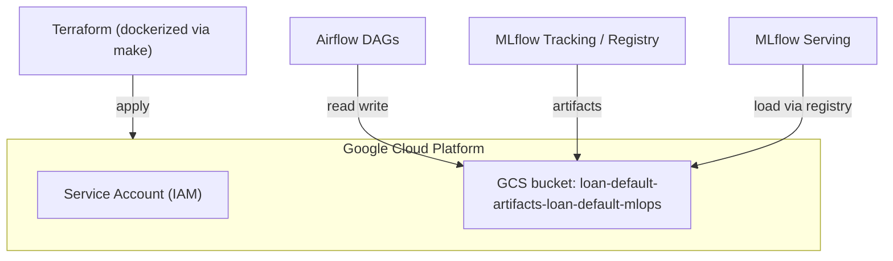

## ☁️ Infrastructure (Terraform)

Provision the minimal GCP resources for artifacts, predictions, and reports — all via **IaC**.

### What Terraform creates

* **GCS bucket**: single canonical store for MLflow artifacts, batch predictions, and monitoring reports
  `gs://loan-default-artifacts-loan-default-mlops/`
* **Service Account (SA)** + **IAM**: credentials used by Airflow/MLflow/serving to access the bucket
* *(Optional)* API enablement and standard labels

> State is kept **locally** (gitignored). For teams, consider a **remote state** backend (e.g., GCS).


### Files

```
infra/terraform/
├── main.tf
├── variables.tf
├── outputs.tf
└── terraform.tfvars.example   # copy → terraform.tfvars (gitignored)
```

**Do not commit**: `terraform.tfvars`, `.terraform/`, `terraform.tfstate*`.


### Configure variables

1. Copy the example and edit:

```bash
cp infra/terraform/terraform.tfvars.example infra/terraform/terraform.tfvars
```

2. Set values (example):

```hcl
# infra/terraform/terraform.tfvars
project_id  = "your-gcp-project-id"
region      = "us-central1"
bucket_name = "loan-default-artifacts-loan-default-mlops"
```

Keep this bucket name consistent everywhere (compose, `.env`, README).


### Run Terraform (via Make)

From repo root:

```bash
make terraform-init
make terraform-plan
make terraform-apply
# later
make terraform-destroy
```

These targets run Terraform **inside the dockerized `terraform` service**, with your SA key auto-mounted at:

```
/opt/airflow/keys/gcs-service-account.json
```


### Authentication

Use a **Service Account key (JSON)** placed at:

```
keys/gcs-service-account.json   # gitignored
```

Docker Compose injects `GOOGLE_APPLICATION_CREDENTIALS` for the Terraform container.


### Minimal IAM for the runtime SA

If you create a dedicated SA used by Airflow/MLflow/Serving, grant **least privilege** on the bucket:

* `roles/storage.objectAdmin` on the bucket (read/write objects)
* *(Optional)* `roles/storage.legacyBucketReader` for listing, if needed by tools

For quick starts, some projects use `roles/storage.admin` (broader than necessary).

---

### After apply

* Update `.env` / compose to match the bucket:

  * `MLFLOW_ARTIFACT_URI=gs://loan-default-artifacts-loan-default-mlops/mlflow`
  * Training data, batch input/output, and report paths under the same bucket prefix
* Verify access by uploading a small file or by running the pipeline once (training → artifact write).


### Visual Overview


---
