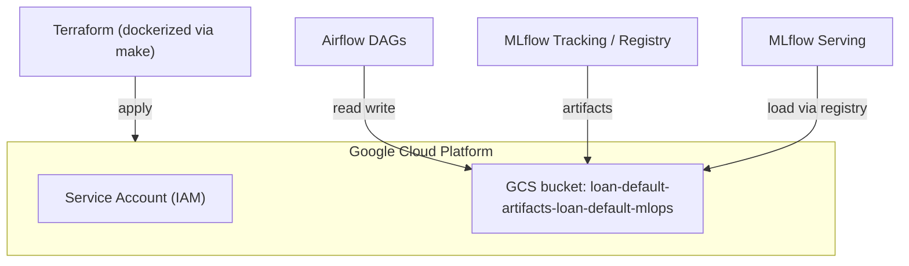

# ☁️ Infrastructure (Terraform)

Provision the minimal **GCP** resources for artifacts, predictions, and reports — all via **Infrastructure-as-Code (IaC)**.

This stack is intentionally small and aligned with the project’s single-bucket design so it’s easy to run in **GitHub Codespaces** and locally.

---

## What this creates

* **GCS bucket** (single canonical location)
  Stores MLflow artifacts, batch predictions, and monitoring reports
  → `gs://<your-bucket>/`
* **Service Account (SA) + IAM**
  Used by Airflow/MLflow/Serving to access the bucket (object read/write)
* *(Optional)* API enablement & standard labels/tags

> **State** is local by default (gitignored). For teams, you can enable **remote state** in GCS (snippet below).

---

## Prerequisites

* A GCP project you control.
* A **Service Account key (JSON)** stored at:

  ```
  keys/gcs-service-account.json  # (gitignored)
  ```
* Docker + Docker Compose (or Codespaces).
  You’ll run Terraform **inside a dockerized tool** via `make`, so you don’t need Terraform installed on your host.

---

## Directory layout

```
infra/terraform/
├── main.tf
├── variables.tf
├── outputs.tf
└── terraform.tfvars.example   # copy → terraform.tfvars (gitignored)
```

**Do not commit:** `terraform.tfvars`, `.terraform/`, `terraform.tfstate*`.

---

## Configure variables

1. Copy the example and edit:

```bash
cp infra/terraform/terraform.tfvars.example infra/terraform/terraform.tfvars
```

2. Fill in your values (example):

```hcl
# infra/terraform/terraform.tfvars
project_id  = "loan-default-mlops"                   # <-- your GCP project
region      = "us-central1"
bucket_name = "loan-default-artifacts-loan-default-mlops"
labels = {
  app     = "loan-default-mlops"
  env     = "dev"
  owner   = "you"
}
```

> Keep this **bucket name** consistent across:
>
> * `.env` (`GCS_BUCKET`, `MLFLOW_ARTIFACT_URI`, data/predictions/reports paths)
> * Docker Compose
> * README/docs

---

## How to run (via Make)

All Terraform commands run inside the dockerized `terraform` service with your SA key mounted at `/opt/airflow/keys/gcs-service-account.json`.

From repo root:

```bash
make terraform-init
make terraform-plan
make terraform-apply
# later, to tear down:
make terraform-destroy
```

These are thin wrappers around:

```
docker compose -f airflow/docker-compose.yaml run --rm terraform "terraform <cmd>"
```

---

## App ↔️ Infra mapping

After `apply`, set/update these in your `.env` (or confirm they match):

```bash
# Single source of truth (bucket)
GCS_BUCKET=<your-bucket>  # e.g., loan-default-artifacts-loan-default-mlops

# MLflow artifact root lives under the same bucket
MLFLOW_ARTIFACT_URI=gs://<your-bucket>/mlflow

# Training / batch / reports should use the same bucket prefix:
TRAIN_DATA_PATH=gs://<your-bucket>/data/loan_default_selected_features_clean.csv
PREDICTION_INPUT_PATH=gs://<your-bucket>/data/batch_input.csv
PREDICTION_OUTPUT_PATH=gs://<your-bucket>/predictions/predictions.csv
```

> The Airflow DAGs, batch prediction, and monitoring code read these from env.

---

## Authentication model

* The Terraform container and Airflow/MLflow/Serving containers all rely on:

  ```
  GOOGLE_APPLICATION_CREDENTIALS=/opt/airflow/keys/gcs-service-account.json
  ```
* Compose mounts your local, gitignored key:

  ```
  keys/gcs-service-account.json  →  /opt/airflow/keys/gcs-service-account.json
  ```

**Least privilege (recommended for the runtime SA):**

* Grant **`roles/storage.objectAdmin`** on the bucket (read/write objects)

  * Optionally **`roles/storage.legacyBucketReader`** if you need bucket-level listing in some tools
* Avoid broad `storage.admin` in production.

---

## (Optional) Remote state in GCS

For teams, you can store Terraform state in a GCS bucket.

1. Create a dedicated state bucket once (can be manual or a separate bootstrap TF):

```
gsutil mb -l us-central1 gs://<your-tf-state-bucket>
```

2. Add this **backend** block to `infra/terraform/main.tf` (top of file), then re-init:

```hcl
terraform {
  backend "gcs" {
    bucket = "<your-tf-state-bucket>"
    prefix = "loan-default-mlops/terraform-state"
  }
}
```

Re-init to migrate state:

```bash
make terraform-init
```

> Keep the state bucket separate from your artifacts bucket.

---

## Quick validation (post-apply)

**A. Check bucket exists**

```bash
gsutil ls gs://<your-bucket>/
```

**B. Check MLflow artifact root**

```bash
gsutil ls gs://<your-bucket>/mlflow || echo "mlflow path will appear after first run"
```

**C. Run a pipeline once**

* `make start`
* Trigger `train_pipeline_dag` in Airflow UI
* Verify artifacts in MLflow UI and objects in `gs://<your-bucket>/mlflow/...`

---

## Troubleshooting

### “403 Forbidden” when reading/writing GCS

* Ensure the SA used by the containers has **objectAdmin** on the bucket.
* Confirm the key is mounted correctly:

  ```
  /opt/airflow/keys/gcs-service-account.json
  ```
* Inside the container: `gcloud auth activate-service-account --key-file=/opt/airflow/keys/gcs-service-account.json`

### MLflow can’t write artifacts to GCS

* Check `MLFLOW_ARTIFACT_URI` points to `gs://<your-bucket>/mlflow`
* Confirm network/DNS inside containers can reach `storage.googleapis.com`

### Bucket name mismatch

* Ensure the exact same `<your-bucket>` is used in:

  * `.env`
  * Terraform `terraform.tfvars`
  * Any hard-coded sample paths in docs/scripts

---

### Visual Overview


---

## Clean up

To delete all managed resources:

```bash
make terraform-destroy
```

> This removes the bucket **and its contents** if you configured Terraform to manage it. Back up anything you want to keep first.

---

